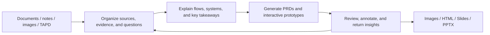

# Yogurt AI

<p align="center">
  
</p>

<p align="center"><strong>Turn scattered material into a product-thinking canvas you can understand, edit, and deliver.</strong></p>

<p align="center">
  <a href="README.md">中文</a> ·
  <a href="#from-inspiration-to-deliverables">Product experience</a> ·
  <a href="#core-capabilities">Capabilities</a> ·
  <a href="#complete-case-an-ai-interactive-filmgame">Complete case</a> ·
  <a href="#installation">Installation</a> ·
  <a href="#three-minute-quick-start">Quick start</a>
</p>

Yogurt AI is a visual thinking and product-creation canvas for Codex. Give it documents, notes, images, conversation context, and accessible TAPD content. In one editable workspace, you can organize evidence and ideas, explain a system, generate PRDs and interactive prototypes, review the result, and turn the canvas into images, HTML, Slides, or PowerPoint.

The result is not a static picture. Cards, zones, relations, prototypes, and creative content remain available for selection, movement, follow-up questions, and revision. Important changes can be previewed and safely undone.

<p align="center">
  
</p>
<p align="center"><sub>Start with source material, behavioral observations, and open questions; grow them into hypotheses and a next experiment.</sub></p>

## From Inspiration To Deliverables



| What you are doing | What Yogurt AI produces | What you can do next |
| --- | --- | --- |
| Digesting research, meetings, and requirements | Source-linked cards that separate facts, observations, hypotheses, and questions | Cluster, connect, and question the material until a panorama emerges |
| Explaining a complex flow or system | An editable line diagram with a central takeaway and clear reading order | Move nodes, rewrite relations, and add states or exceptions |
| Turning a product idea into a plan | Shaping documents, module PRDs, and interactive pages | Annotate the real UI, review it beside the requirements, and return conclusions to the canvas |
| Creating visual content and presentations | Generated or revised images, HTML, and Slides | Present, download, or consolidate everything into panorama HTML and PowerPoint |

## Core Capabilities

### 1. Organize Real Source Material On A Canvas

After you import documents, images, and notes, Yogurt AI preserves source paths and verbatim excerpts while recording agent summaries and inference separately. Work with cards, relations, zones, and freehand annotations as you would on a whiteboard, or ask the agent to build a panorama around one question.

When only a local area needs revision, use `AI 圈选` to circle the relevant objects and add arrows, strike-throughs, groups, or written instructions. The agent combines the selected content and your marks to update that area while leaving everything outside it in place.


### 2. Turn Complex Relationships Into Editable Line Diagrams

Select a group of source cards and choose `生成画布框线图`. Yogurt AI identifies the most important takeaway, then organizes the objects, states, relationships, and reading order needed to explain it. The default result uses native cards, semantic zones, and bound connectors, so every element can be selected, moved, rewritten, and extended.

Layouts include horizontal, vertical, reversed, center-out, and board-to-peers structures. Visual grammar distinguishes primary paths, alternatives, bidirectional synchronization, undirected associations, and containment. When a diagram needs exact ports, dense obstacle routing, or detailed swimlanes, Yogurt AI can also create a security-validated HTML + inline-SVG block.


[Explore the line-diagram case, reusable prompt, and semantic specification](examples/semantic-diagram/ai-interactive-film-system/)

### 3. Generate PRDs And Interactive Prototypes From Rough Ideas

Select the product-related region of the canvas and choose `生成交互 PRD`. Yogurt AI combines the current conversation, selection or page, product hypotheses, and TAPD content that an authorized connector has successfully read. It produces traceable shaping documents, module PRDs, and self-contained interactive prototypes.

Review no longer depends on fragile screenshot coordinates. Notes stay attached to real interface elements, so you can operate the prototype and compare it with its PRD in the same view. When review is complete, Yogurt AI shows a return preview first; after confirmation, it writes the conclusions back as product zones, cards, and relations on the source canvas.


[Explore the complete Product Bridge case, PRDs, prototypes, and run instructions](examples/product-bridge/ai-interactive-film-case/)

### 4. Create Content And Take The Whole Canvas With You

Yogurt AI keeps creation and delivery tools in the same menu:

| Capability | Best for | Result |
| --- | --- | --- |
| AI Image | Generate visuals from prompts and references; revise images from canvas annotations | A new image placed at the intended location while the source and notes remain |
| AI HTML | Create runnable dashboards, explainers, or interactive content | A single-file HTML artifact embedded in the canvas and available for editing or download |
| AI Slides | Generate a coherent presentation from a topic and reference material | A deck you can preview, navigate, and present fullscreen inside Yogurt AI |
| Consolidated export | Bring together cards, connectors, images, HTML, and freehand content | A zoomable HTML panorama or an editable PowerPoint |

<table>
  <tr>
    <td width="50%"><br><strong>AI Image</strong>: combine a prompt, references, and canvas placement into a visual.</td>
    <td width="50%"><br><strong>Annotation-driven image revision</strong>: keep the source and generate a clean version beside it.</td>
  </tr>
  <tr>
    <td width="50%"><br><strong>AI HTML</strong>: turn an idea into runnable, editable interactive content.</td>
    <td width="50%"><br><strong>AI Slides</strong>: generate a coherent sequence and present it directly from the canvas.</td>
  </tr>
  <tr>
    <td width="50%"><br><strong>HTML panorama</strong>: consolidate the current canvas into a standalone file with an outline.</td>
    <td width="50%"><br><strong>PowerPoint export</strong>: preserve the panorama, outline, and native editable text.</td>
  </tr>
</table>

## Complete Case: An AI Interactive Film/Game

“Branching Echoes” demonstrates the full journey. It starts with one sentence—let players advance a cinematic story through choices or natural language. Yogurt AI first maps creator constraints, player actions, the AI director, a safety gate, and the state ledger. It then generates product documents and five interactive pages before supporting review on the real UI and returning the conclusions to the canvas.

| Stage | Case artifact |
| --- | --- |
| Explain the system | A native editable system diagram for the AI interactive film/game |
| Define the product | Shaping plus PRDs for the AI narrative engine, player experience, and creator studio |
| Validate the experience | Five pages covering discovery, interactive play, explainable endings, story authoring, and release checks |
| Review the plan | Prototype and PRD side by side, 14 stable annotation anchors, and a visual page map |
| Continue thinking | Confirmed conclusions returned to Yogurt product zones for the next iteration |

<table>
  <tr>
    <td width="50%"><br><strong>See the complete product and page journey</strong></td>
    <td width="50%"><br><strong>Then turn the experience into an interactive page</strong></td>
  </tr>
</table>

[Browse the complete product case](examples/product-bridge/ai-interactive-film-case/) · [Browse the canvas line-diagram case](examples/semantic-diagram/ai-interactive-film-system/)

## Installation

You need Node.js and Git. Use Codex CLI to install the plugin; open the Codex desktop app for the full interactive canvas experience. Run:

```bash
git clone https://github.com/suud003/Cowart.git
cd Cowart
npm install
npm run build
codex plugin marketplace add <absolute-path-to-Cowart>
codex plugin add cowart-thinking-canvas@cowart-thinking-github
codex plugin list
```

After installation, enter `/plugins` in Codex CLI to confirm that Yogurt AI is enabled, then start a new task so its skills and canvas tools load completely. See the [Codex Plugins documentation](https://learn.chatgpt.com/docs/plugins) for other installation surfaces.

## Three-minute Quick Start

### 1. Open The Canvas

In a new Codex task, ask:

```text
Open the Yogurt AI canvas for this project.
```

### 2. Add Material And Grow The First Map

Put documents, images, or notes in the active project, then ask:

```text
Organize the material under docs/research in Yogurt AI.
Preserve sources and important verbatim excerpts. Separate evidence,
hypotheses, and open questions, then build an editable panorama around
“why users abandon this workflow.”
```

### 3. Choose The Next Deliverable

Circle content directly or open the `Yogurt AI` menu in the upper-right corner:

- To explain a flow or system, choose `生成画布框线图`.
- To advance a product plan, choose `生成交互 PRD`.
- To create visual content, add an `AI 图片`, `AI HTML`, or `AI Slides` shape.
- To share the result, choose `整合为 HTML` or `整合为 PowerPoint`.


## Data, Provenance, And Safety

- Canvas data lives in the current project's `canvas/pages/<page-id>/` directory; page images and HTML live in its matching `assets/` directory.
- Source paths, verbatim excerpts, and agent summaries are stored separately, making it clear what came from the material and what came from analysis or inference.
- External links such as TAPD count as read material only after an authorized connector in the user's environment returns their content. Yogurt AI never invents requirements from an inaccessible URL.
- Non-trivial changes show a preview first, write only after the canvas is still in the expected state, and retain guarded undo.
- Precise SVG blocks pass structural and script-safety validation before entering the canvas.
- Files outside the project are copied into canvas materials only with explicit user permission.

## Technical Information

<details>
<summary><strong>Built-in skills and workspace validation</strong></summary>

- `cowart-thinking-canvas:cowart-thinking-agent`: organize sources, build thinking spaces, and preview and apply local revisions.
- `cowart-thinking-canvas:cowart-semantic-diagram`: create and revise traceable line diagrams on the current canvas.
- `cowart-thinking-canvas:cowart-product-bridge`: turn product material into PRDs and interactive prototypes, then handle reviewed returns.
- `cowart-thinking-canvas:cowart-image-gen` / `cowart-image-edit`: generate images and perform annotation-driven revisions.
- `cowart-thinking-canvas:cowart-open-canvas`: open the native Yogurt AI canvas for the active project.

Validate a generated Product Bridge workspace:

```powershell
python -B -X utf8 skills/cowart-product-bridge/scripts/validate_workspace.py <workspace> --strict
python -B -X utf8 skills/cowart-product-bridge/scripts/serve.py <workspace>
```

Validate a precise SVG line diagram:

```powershell
node skills/cowart-semantic-diagram/scripts/validate-semantic-svg.mjs --root <artifact-root> <diagram.html>
```

</details>

<details>
<summary><strong>Local development</strong></summary>

```bash
npm install
npm run dev
npm run build
```

You can also start the Vite canvas preview for a specific user project:

```bash
./scripts/start-canvas.sh /path/to/user/project
```

The local Vite page is a UI development surface and does not include the Codex agent message bridge. Use the native Yogurt AI canvas inside Codex to send AI lasso, line-diagram, and Product Bridge requests directly.

Useful environment variables:

- `COWART_PORT`: local service port, default `43217`.
- `COWART_PROJECT_DIR`: the user project that owns the canvas data.
- `COWART_CANVAS_DIR`: canvas data directory, default `$COWART_PROJECT_DIR/canvas`.

</details>

## Developer

ZHONG XIN  
zhongxin123456@gmail.com  
https://www.jiqiren.ai

## Open Source, Licensing, And Acknowledgments

This repository is a public fork of [zhongerxin/Cowart](https://github.com/zhongerxin/Cowart). It preserves the GitHub fork relationship and the upstream MIT license. The current public version is maintained at [`suud003/Cowart`](https://github.com/suud003/Cowart).

- [tldraw/tldraw](https://github.com/tldraw/tldraw) provides the infinite canvas, shape editing, and interaction runtime. Version `5.1.1` is pinned. tldraw uses its own license; public production deployment requires an applicable trial, commercial, or other license. See [`licenses/TLDRAW-LICENSE.md`](licenses/TLDRAW-LICENSE.md).
- [excalidraw/excalidraw](https://github.com/excalidraw/excalidraw) is the design reference for toolbar layout, hand-drawn visual language, and interaction details. It is not a runtime dependency.
- Excalifont, Xiaolai, and Assistant fonts use the SIL Open Font License 1.1. See [`src/assets/fonts/FONT-LICENSES.md`](src/assets/fonts/FONT-LICENSES.md).
- [PptxGenJS](https://github.com/gitbrent/PptxGenJS) generates standards-compliant `.pptx` files in the browser under the MIT License.

The root `LICENSE` covers upstream Cowart code and the MIT-licensed part of this fork only; it does not supersede third-party licenses. See [`THIRD_PARTY_NOTICES.md`](THIRD_PARTY_NOTICES.md) for the complete notices.
