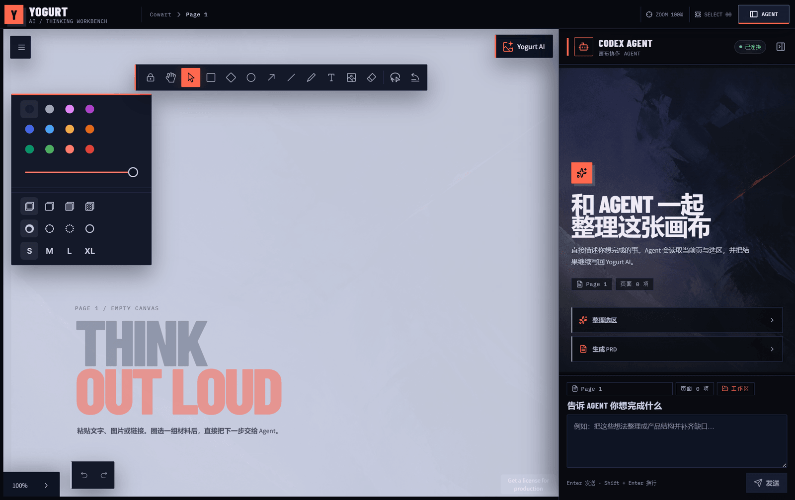
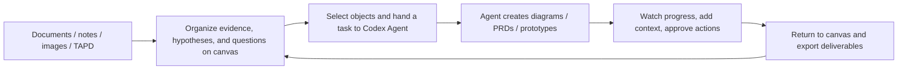
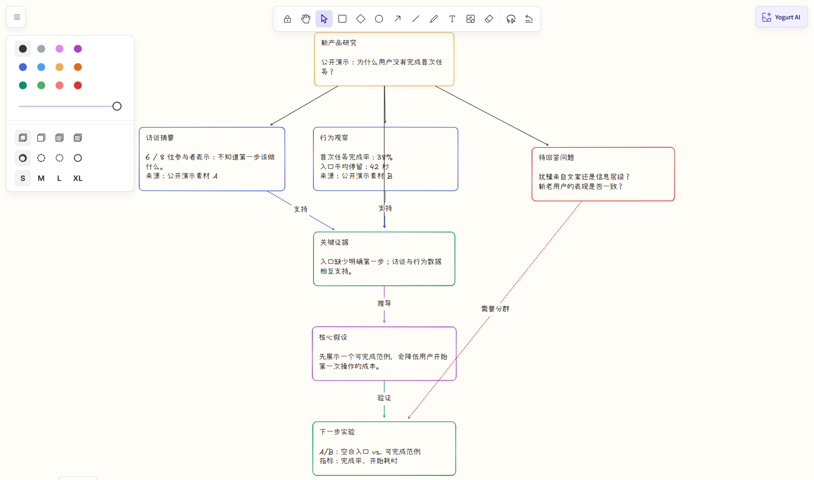
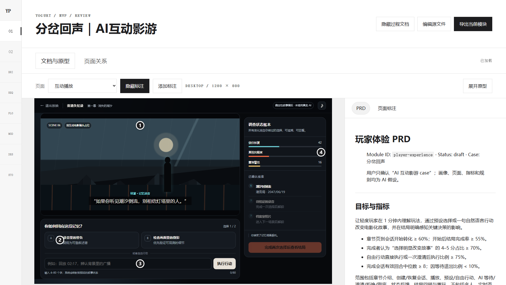
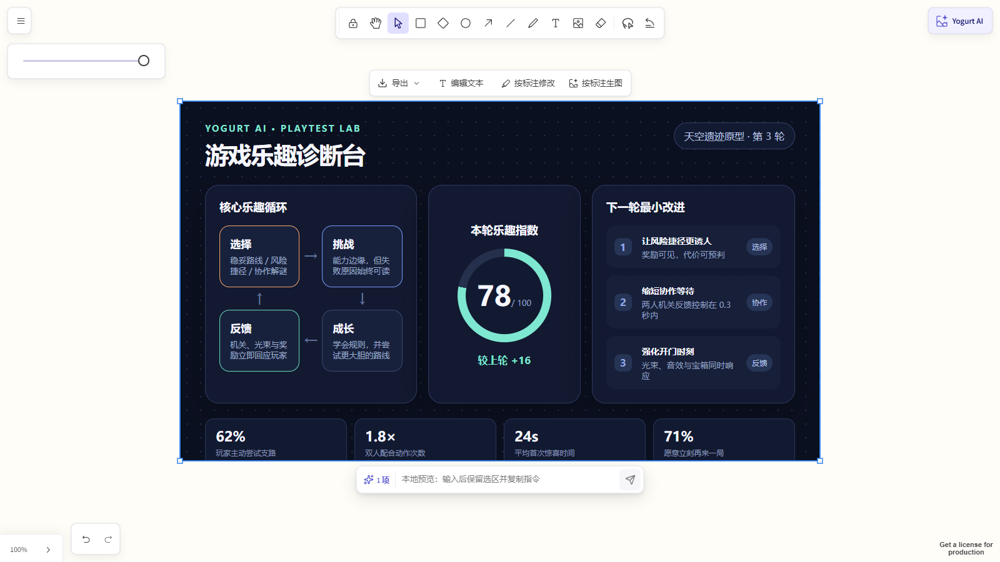
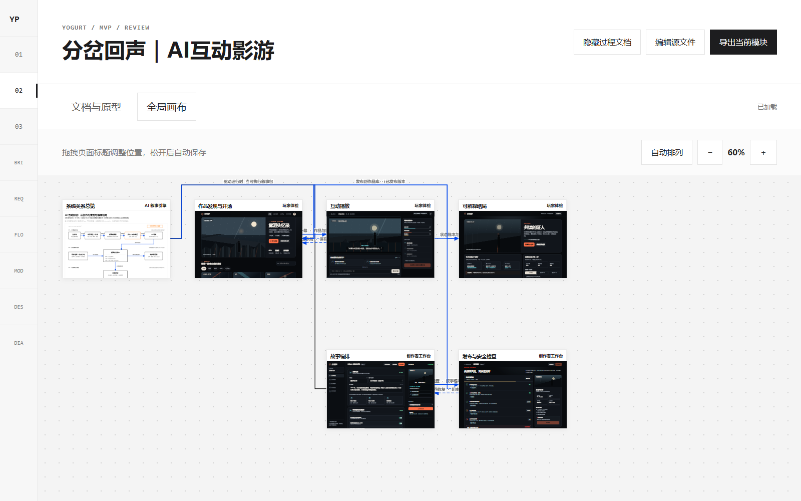
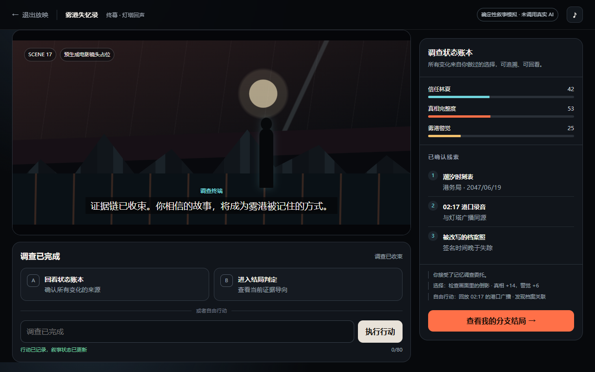
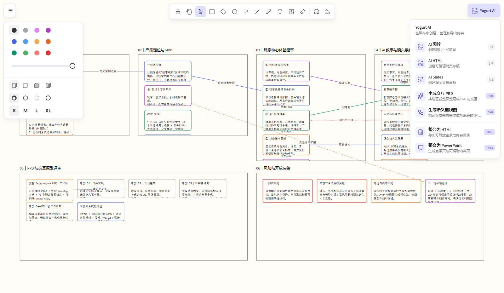

# Yogurt AI

<p align="center">
  
</p>

<p align="center"><strong>Think on the canvas, hand the work to Codex Agent, and bring the result back for the next iteration.</strong></p>

<p align="center"><strong>Yogurt AI Desktop · Beta</strong> · Local-first · Editable canvas · Codex Agent bridge</p>

<p align="center">
  <a href="README.md">中文</a> ·
  <a href="#windows-desktop-app-beta">Windows download</a> ·
  <a href="#one-complete-product-workflow">Product experience</a> ·
  <a href="#core-experience">Core experience</a> ·
  <a href="#complete-case-an-ai-interactive-filmgame">Complete case</a> ·
  <a href="#three-minute-quick-start">Quick start</a>
</p>

Yogurt AI is an installable AI product workspace, available as both a standalone desktop app and a Codex plugin. It puts a native tldraw infinite canvas and Codex Agent in the same interface. Bring in documents, notes, images, conversations, and authorized TAPD content; select real canvas objects; then ask the agent to organize material, complete a product structure, or generate a line diagram, PRD, or interactive prototype.

The agent reads the active page and stable object IDs while streaming status, plans, and change summaries back into the workspace. Sensitive actions are approved in place. Results remain selectable, movable, editable, and open to follow-up questions instead of becoming a static image. The canvas is both the starting point for thought and the shared record after the agent finishes.

<p align="center">
  
</p>
<p align="center"><sub>The native canvas and Codex Agent workbench share the active project, page, and object context in one window.</sub></p>

## Windows Desktop App (Beta)

Regular users do not need to install Node.js, Git, or a global Codex CLI. Start with the Windows x64 installer:

1. Download `Yogurt-AI-Beta-Setup-<version>-x64.exe`. The installer is currently supplied by the maintainer or a local build; it is publicly available only when an attachment is actually present on GitHub Releases.
2. Double-click the installer and follow the setup wizard. It creates Desktop and Start Menu shortcuts.
3. On first launch, choose a product folder as the workspace. Canvas data, generated files, and the project session stay there. Cancelling the picker does not crash the app; you can choose a folder later from the Agent panel.
4. After the canvas opens, Codex Agent connects through the bundled, compatibility-tested Codex and Node runtimes and reuses the current Codex sign-in on the computer. If sign-in is required, click **Sign in to Codex** in the panel: Yogurt AI opens the official browser authorization flow and connects automatically after success—no terminal command is required.

The current local Beta installer is unsigned, so Windows SmartScreen may display a “Windows protected your PC” warning. Run only an installer obtained from a trusted source whose filename and checksum match the maintainer's information. This notice does not imply that an installer has been uploaded to GitHub Releases.

## One Complete Product Workflow



| Where you begin | How Codex Agent participates | What remains |
| --- | --- | --- |
| Scattered research, meeting notes, and requirement links | Organizes source-grounded facts, observations, hypotheses, and open questions | A knowledge panorama you can keep clustering, connecting, and questioning |
| A group of cards or a system that needs explanation | Reads the active page and exact selection, then plans and creates a semantic structure | Native editable cards, zones, and bound connectors |
| An incomplete product idea | Completes constraints and acceptance criteria, then creates PRDs and interactive pages | A reviewable product workspace with annotations and canvas return |
| A mature canvas | Consolidates cards, images, HTML, Slides, and freehand work | A shareable HTML panorama or editable PowerPoint |

## Core Experience

### 1. Give The Canvas And Codex Agent The Same Context

The desktop app includes a persistent Codex Agent workbench on the right. It knows the active project, page, selected objects, and their stable IDs. Yogurt AI saves the latest canvas before sending a task, so the agent works from the real structure in front of you instead of a screenshot with drifting coordinates.

Write any request or start with `Organize selection`, `Generate PRD`, or `Generate diagram`. While Codex works, the panel streams replies, plans, change summaries, and task status. When the agent needs a scope, choice, or parameter, a structured form appears directly in the activity stream. External authorization requests show only the destination domain and open through the desktop app after your explicit confirmation. You can also approve or reject controlled actions and interrupt an active turn. Reopening the same project resumes its saved agent session.

After you import documents, images, and notes, Yogurt AI preserves source paths and verbatim excerpts while recording agent summaries and inference separately. Work with cards, relations, zones, and freehand annotations as you would on a whiteboard, or ask the agent to build a panorama around one question.

When only a local area needs revision, use `AI 圈选` to circle the relevant objects and add arrows, strike-throughs, groups, or written instructions. The agent combines the selected content and your marks to update that area while leaving everything outside it in place.

<table>
  <tr>
    <td width="50%"><br><strong>Grow material into structure</strong>: turn sources, observations, and questions into hypotheses and a next experiment.</td>
    <td width="50%"><br><strong>Change only what needs attention</strong>: select objects and add annotations while leaving the rest of the canvas in place.</td>
  </tr>
</table>

### 2. Turn Complex Relationships Into Editable Line Diagrams

Select a group of source cards and choose `生成画布框线图`. Yogurt AI identifies the most important takeaway, then organizes the objects, states, relationships, and reading order needed to explain it. The default result uses native cards, semantic zones, and bound connectors, so every element can be selected, moved, rewritten, and extended.

Layouts include horizontal, vertical, reversed, center-out, and board-to-peers structures. Visual grammar distinguishes primary paths, alternatives, bidirectional synchronization, undirected associations, and containment. When a diagram needs exact ports, dense obstacle routing, or detailed swimlanes, Yogurt AI can also create a security-validated HTML + inline-SVG block.


[Explore the line-diagram case, reusable prompt, and semantic specification](examples/semantic-diagram/ai-interactive-film-system/)

### 3. Generate PRDs And Interactive Prototypes From Rough Ideas

Select the product-related region of the canvas and choose `生成交互 PRD`. Yogurt AI combines the current conversation, selection or page, product hypotheses, and TAPD content that an authorized connector has successfully read. It produces traceable shaping documents, module PRDs, and self-contained interactive prototypes.

Review no longer depends on fragile screenshot coordinates. Notes stay attached to real interface elements, so you can operate the prototype and compare it with its PRD in the same view. When review is complete, Yogurt AI shows a return preview first; after confirmation, it writes the conclusions back as product zones, cards, and relations on the source canvas.



[Explore the complete Product Bridge case, PRDs, prototypes, and run instructions](examples/product-bridge/ai-interactive-film-case/)

### 4. Create Content And Take The Whole Canvas With You

Yogurt AI keeps creation and delivery tools in the same menu:

| Capability | Best for | Result |
| --- | --- | --- |
| AI Image | Generate visuals from prompts and references; revise images from canvas annotations | A new image placed at the intended location while the source and notes remain |
| AI HTML | Create runnable dashboards, explainers, or interactive content | A single-file HTML artifact embedded in the canvas and available for editing or download |
| AI Slides | Generate a coherent presentation from a topic and reference material | A deck you can preview, navigate, and present fullscreen inside Yogurt AI |
| Consolidated export | Bring together cards, connectors, images, HTML, and freehand content | A zoomable HTML panorama or an editable PowerPoint |

<table>
  <tr>
    <td width="50%"><br><strong>AI Image</strong>: combine a prompt, references, and canvas placement into a visual.</td>
    <td width="50%"><br><strong>Annotation-driven image revision</strong>: keep the source and generate a clean version beside it.</td>
  </tr>
  <tr>
    <td width="50%"><br><strong>AI HTML</strong>: turn an idea into runnable, editable interactive content.</td>
    <td width="50%"><br><strong>AI Slides</strong>: generate a coherent sequence and present it directly from the canvas.</td>
  </tr>
  <tr>
    <td width="50%"><br><strong>HTML panorama</strong>: consolidate the current canvas into a standalone file with an outline.</td>
    <td width="50%"><br><strong>PowerPoint export</strong>: preserve the panorama, outline, and native editable text.</td>
  </tr>
</table>

## Complete Case: An AI Interactive Film/Game

“Branching Echoes” demonstrates the full journey. It starts with one sentence—let players advance a cinematic story through choices or natural language. Yogurt AI first maps creator constraints, player actions, the AI director, a safety gate, and the state ledger. It then generates product documents and five interactive pages before supporting review on the real UI and returning the conclusions to the canvas.

| Stage | Case artifact |
| --- | --- |
| Explain the system | A native editable system diagram for the AI interactive film/game |
| Define the product | Shaping plus PRDs for the AI narrative engine, player experience, and creator studio |
| Validate the experience | Five pages covering discovery, interactive play, explainable endings, story authoring, and release checks |
| Review the plan | Prototype and PRD side by side, 14 stable annotation anchors, and a visual page map |
| Continue thinking | Confirmed conclusions returned to Yogurt product zones for the next iteration |

<table>
  <tr>
    <td width="50%"><br><strong>See the complete product and page journey</strong></td>
    <td width="50%"><br><strong>Then turn the experience into an interactive page</strong></td>
  </tr>
</table>

[Browse the complete product case](examples/product-bridge/ai-interactive-film-case/) · [Browse the canvas line-diagram case](examples/semantic-diagram/ai-interactive-film-system/)

## Developer And Advanced Use

The installer already includes the pinned Codex and Node runtimes required by the desktop app. The source workflow below is for development, debugging, or custom integration—not normal installation.

<details>
<summary><strong>Run from source</strong></summary>

```bash
git clone https://github.com/suud003/Cowart.git
cd Cowart
npm install
npm run desktop
```

Source launch builds the renderer and opens Electron. First launch still uses the native folder picker; developers may also set a workspace explicitly:

```powershell
$env:YOGURT_WORKSPACE_ROOT = 'D:\path\to\your-product'
npm run desktop
```

A global installation or entry override is needed only when debugging an external Codex CLI:

```powershell
npm install -g @openai/codex
codex login
$env:YOGURT_CODEX_JS = "$env:APPDATA\npm\node_modules\@openai\codex\bin\codex.js"
```

Developers can also validate the repository's Codex plugin workflow:

```bash
npm run build
codex plugin marketplace add .
codex plugin add cowart-thinking-canvas@cowart-thinking-github
codex plugin list
```

See [`desktop/README.md`](desktop/README.md) for implementation details, environment variables, and troubleshooting.

</details>

## Three-minute Quick Start

### 1. Choose A Real Project

Open Yogurt AI from its Desktop shortcut and choose a product folder in the first-launch window. The app reads and saves the canvas in that workspace while the panel on the right connects to the local Codex Agent automatically. If authorization is required, click **Sign in to Codex** in the Agent panel and finish in the browser.

### 2. Add Material And Build The First Structure

Put documents, images, or notes in the active project, then send this from the agent workbench:

```text
Organize the material under docs/research in Yogurt AI.
Preserve sources and important verbatim excerpts. Separate evidence,
hypotheses, and open questions, then build an editable panorama around
“why users abandon this workflow.”
```

### 3. Select Objects And Hand Off The Next Step

Select the cards you want to advance, choose a quick task in the agent workbench, or state the goal directly:

- `Turn this selection into a line diagram that explains the central takeaway.`
- `Use these materials and accessible TAPD content to create a reviewable PRD and interactive prototype.`
- `Return the confirmed review conclusions to the original canvas while preserving provenance.`

### 4. Review, Return, And Deliver

Follow the agent's plan and change summaries in the workbench, approving controlled actions when needed. Continue moving or rewriting the resulting canvas objects. When the work is ready, use the `Yogurt AI` menu to consolidate it as HTML or PowerPoint, or continue creating AI images, HTML, and Slides.



## Data, Provenance, And Safety

- Canvas data lives in the current project's `canvas/pages/<page-id>/` directory; page images and HTML live in its matching `assets/` directory.
- Source paths, verbatim excerpts, and agent summaries are stored separately, making it clear what came from the material and what came from analysis or inference.
- External links such as TAPD count as read material only after an authorized connector in the user's environment returns their content. Yogurt AI never invents requirements from an inaccessible URL.
- Non-trivial changes show a preview first, write only after the canvas is still in the expected state, and retain guarded undo.
- Precise SVG blocks pass structural and script-safety validation before entering the canvas.
- Files outside the project are copied into canvas materials only with explicit user permission.
- The desktop app connects to Codex App Server over local stdio. The web renderer cannot issue arbitrary RPC calls, shell commands, process-spawn requests, or MCP tool calls outside the allowlist.
- Yogurt AI does not call private `chatgpt.com/backend-api/...` endpoints. The desktop agent uses the local stdio Codex App Server bridge. Any future direct model API integration must use the public `https://api.openai.com/v1/responses` endpoint with API Key authentication.
- Agent requests to change files or execute commands are surfaced in the workbench for user approval.

## Technical Information

<details>
<summary><strong>Built-in skills and workspace validation</strong></summary>

- `cowart-thinking-canvas:cowart-thinking-agent`: organize sources, build thinking spaces, and preview and apply local revisions.
- `cowart-thinking-canvas:cowart-semantic-diagram`: create and revise traceable line diagrams on the current canvas.
- `cowart-thinking-canvas:cowart-product-bridge`: turn product material into PRDs and interactive prototypes, then handle reviewed returns.
- `cowart-thinking-canvas:cowart-image-gen` / `cowart-image-edit`: generate images and perform annotation-driven revisions.
- `cowart-thinking-canvas:cowart-open-canvas`: open the native Yogurt AI canvas for the active project.

Validate a generated Product Bridge workspace:

```powershell
python -B -X utf8 skills/cowart-product-bridge/scripts/validate_workspace.py <workspace> --strict
python -B -X utf8 skills/cowart-product-bridge/scripts/serve.py <workspace>
```

Validate a precise SVG line diagram:

```powershell
node skills/cowart-semantic-diagram/scripts/validate-semantic-svg.mjs --root <artifact-root> <diagram.html>
```

</details>

<details>
<summary><strong>Local development</strong></summary>

```bash
npm install
npm run dev
npm run build
npm run desktop
```

You can also start the Vite canvas preview for a specific user project:

```bash
./scripts/start-canvas.sh /path/to/user/project
```

The local Vite page is only a canvas UI development surface and does not include the Codex Agent bridge. Run `npm run desktop` for the complete local agent workbench. You can also install the Yogurt AI plugin in Codex to use the native widget with the same canvas capabilities.

Useful environment variables:

- `COWART_PORT`: local service port, default `43217`.
- `COWART_PROJECT_DIR`: the user project that owns the canvas data.
- `COWART_CANVAS_DIR`: canvas data directory, default `$COWART_PROJECT_DIR/canvas`.
- `YOGURT_WORKSPACE_ROOT`: product project used by the desktop app.
- `YOGURT_CODEX_JS`: explicit Codex CLI JavaScript entry when Windows discovery is unavailable.
- `YOGURT_VITE_DEV_URL`: local Vite URL for desktop development; only loopback HTTP URLs are accepted.
- `VITE_TLDRAW_LICENSE_KEY`: a valid tldraw SDK license key injected at build time; without one, the official tldraw watermark remains visible as required by its license.

</details>

## Developer

ZHONG XIN  
zhongxin123456@gmail.com  
https://www.jiqiren.ai

## Open Source, Licensing, And Acknowledgments

This repository is a public fork of [zhongerxin/Cowart](https://github.com/zhongerxin/Cowart). It preserves the GitHub fork relationship and the upstream MIT license. The current public version is maintained at [`suud003/Cowart`](https://github.com/suud003/Cowart).

- [tldraw/tldraw](https://github.com/tldraw/tldraw) provides the infinite canvas, shape editing, and interaction runtime. Version `5.1.1` is pinned. Before public or commercial distribution, obtain an applicable tldraw license and configure a valid license key. See [`licenses/TLDRAW-LICENSE.md`](licenses/TLDRAW-LICENSE.md).
- [excalidraw/excalidraw](https://github.com/excalidraw/excalidraw) is the design reference for toolbar layout, hand-drawn visual language, and interaction details. It is not a runtime dependency.
- Excalifont, Xiaolai, and Assistant fonts use the SIL Open Font License 1.1. See [`src/assets/fonts/FONT-LICENSES.md`](src/assets/fonts/FONT-LICENSES.md).
- [PptxGenJS](https://github.com/gitbrent/PptxGenJS) generates standards-compliant `.pptx` files in the browser under the MIT License.

The root `LICENSE` covers upstream Cowart code and the MIT-licensed part of this fork only; it does not supersede third-party licenses. See [`THIRD_PARTY_NOTICES.md`](THIRD_PARTY_NOTICES.md) for the complete notices.
