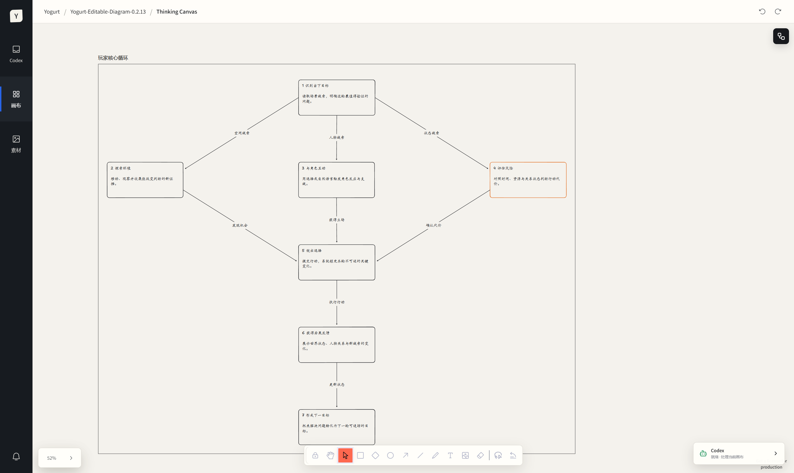
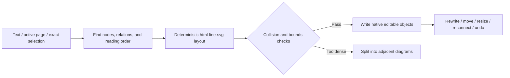

# Yogurt AI

<p align="center">
  
</p>

<p align="center"><strong>Describe a structure. Get an Excalidraw-style diagram that stays fully editable.</strong></p>

<p align="center">Native objects · Codex Agent powered · Project-local persistence</p>

<p align="center">
  <a href="README.md">中文</a> ·
  <a href="#windows-desktop-app">Windows download</a> ·
  <a href="#how-it-works">How it works</a> ·
  <a href="#local-development">Local development</a>
</p>

Yogurt AI turns natural language, the active page, or an exact selection into a native editable relationship diagram. The result is not a flattened image or an indivisible SVG: every card, label, frame, and arrow is a real canvas object that can be moved, resized, rewritten, deleted, and reconnected.

<p align="center">
  
</p>
<p align="center"><sub>Native canvas output: nodes, labels, frames, and bound arrows remain editable.</sub></p>

## One request, one editable diagram

```text
Draw login, permission checks, failure fallback, and retry as an editable flowchart.
```

Yogurt AI reads the actual text and stable object IDs on the current page, identifies nodes and relations, calculates hierarchy and routing with `html-line-svg` layout rules, validates collisions and bounds in a dry run, and only then writes native objects to the canvas.



## Editable by construction

| Capability | Yogurt AI output |
| --- | --- |
| Nodes | Native tldraw geo shapes with directly editable text |
| Connections | Native arrows with real start and end bindings |
| Sections | Native frames whose children move with them |
| Visual style | Separate controls for font, font size, label color, stroke/line color, fill, dash, weight, opacity, and arrowheads |
| Layout | Layered reading order, aligned peers, bounded text, obstacle-aware routes |
| Revision | User-edited text and visual style become the latest Agent context instead of being replaced by stale metadata |
| Traceability | Stable semantic IDs and source shape IDs on every generated object |
| Safety | Dry-run and revision checks before apply, with guarded Agent undo |

The default path creates native editable diagrams only. Dense material is split into adjacent diagrams instead of being rasterized or forced into one tiny, tangled graph. Image previews, PRDs, HTML/SVG blocks, and Slides do not intercept an ordinary diagram request.

## Pure canvas and AI mode

Yogurt AI starts in pure canvas mode. It keeps the native drawing tools, menus, shortcuts, and style panel while leaving the Yogurt shell, Agent, smart lasso, annotations, and generation actions unmounted. The small `AI` button in the upper-right is the only mode entry.

AI mode adds Yogurt navigation and Codex Agent. Turning it off immediately returns to the pure canvas without recreating the editor, canvas store, selection, camera, or undo history. Agent revisions preserve current user-edited styles unless the user explicitly asks for a visual change.

## How it works

1. Open a project in Yogurt AI.
2. Expand Codex Agent and describe what you want to draw, or click the single quick action, **Generate editable diagram**.
3. With no selection, the Agent uses the active page. With a selection, it reads the frozen selection and places the result beside its source.
4. Double-click text, move nodes, restyle cards, or reconnect arrows directly on the canvas.
5. Select the diagram again and ask the Agent to add nodes, change relations, or repack the layout.

Try these prompts:

```text
Draw the loop: user submits a request → AI detects intent → generates a draft →
the user edits it → AI regenerates.
```

```text
Organize the selected cards into a left-to-right architecture diagram.
Use the main path for the normal flow, dashed arrows for exceptions,
and preserve the text I already edited.
```

## Windows desktop app

Regular users do not need Node.js, Git, or a global Codex CLI.

1. Download `Yogurt-AI-Beta-Setup-0.2.14-x64.exe` from the [Yogurt AI Beta 0.2.14 release](https://github.com/suud003/Cowart/releases/tag/v0.2.14%2Bcodex.20260901).
2. Run the installer and choose a project folder on first launch.
3. Expand Codex Agent. If needed, choose **Sign in to Codex** and finish the official browser authorization flow.

The current Beta installer is unsigned, so Windows SmartScreen may show a warning. Download it only from this repository's Releases page and verify the published SHA-256.

## Codex plugin

```bash
git clone https://github.com/suud003/Cowart.git
cd Cowart
npm install
npm run build
codex plugin marketplace add .
codex plugin add cowart-thinking-canvas@cowart-thinking-github
```

Then ask:

```text
Open Yogurt AI and turn this requirement into an Excalidraw-style native editable diagram.
```

`cowart-semantic-diagram` is the default Agent capability. Other legacy capabilities are not implicitly routed from an ordinary diagram request.

## Local development

```bash
npm install
npm run dev
npm run build
npm run desktop
```

Run the complete local verification with:

```bash
npm run check
npm test
npm run build
```

The Vite page is for canvas UI development. `npm run desktop` launches the complete desktop app with the Codex Agent bridge. See [desktop/README.md](desktop/README.md) for desktop implementation and troubleshooting notes.

## Data and safety

- Canvas data is stored under `canvas/pages/<page-id>/` in the active project.
- Stable object IDs, source shape IDs, and snapshot revisions prevent screenshot-coordinate drift.
- Normal additions and updates use safe operation tools. Deleting user content or mutating non-Agent objects requires stronger authorization.
- Automatic mode only continues reversible canvas work inside the current workspace.
- The desktop app connects to Codex App Server locally over stdio; it does not call `chatgpt.com/backend-api/...`.

## Technology and acknowledgements

Yogurt AI uses [tldraw](https://github.com/tldraw/tldraw) as its native infinite-canvas editing runtime and draws on [Excalidraw](https://github.com/excalidraw/excalidraw) for its hand-drawn visual language, tool interaction, and bound-arrow experience. Excalidraw is a design reference, not a runtime dependency.

- `cowart-semantic-diagram` converts source material into native editable semantic diagrams.
- `html-line-svg` supplies the teaching claim, relation grammar, reading order, spacing, ports, and routing rules.
- Excalifont, Xiaolai, and Assistant fonts use the SIL Open Font License 1.1.
- tldraw uses its own license; see [licenses/TLDRAW-LICENSE.md](licenses/TLDRAW-LICENSE.md) before public or commercial distribution.

This repository is a public fork of [zhongerxin/Cowart](https://github.com/zhongerxin/Cowart), maintained at [suud003/Cowart](https://github.com/suud003/Cowart). See [THIRD_PARTY_NOTICES.md](THIRD_PARTY_NOTICES.md) for complete notices.

## Developer

ZHONG XIN  
zhongxin123456@gmail.com  
https://www.jiqiren.ai
