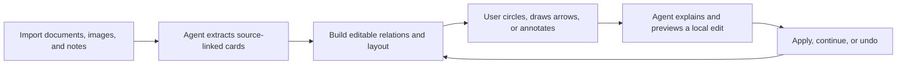
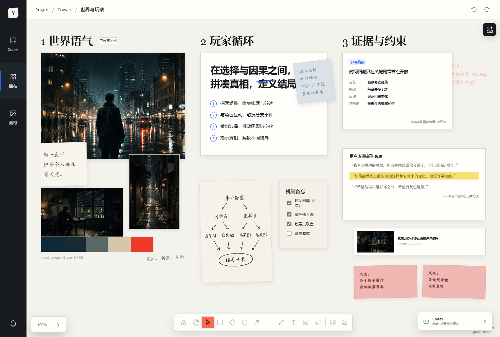
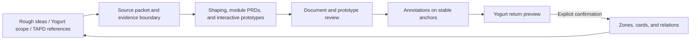
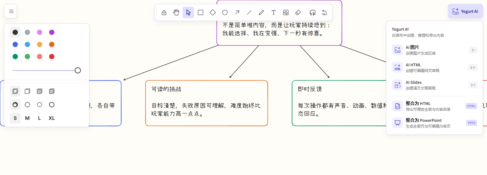

# Yogurt AI

<p align="center">
  
</p>

<p align="center"><strong>Turn documents, knowledge, images, and hand-drawn annotations into a non-linear thinking canvas that stays editable, supports local AI revision, explains its changes, and can undo them safely.</strong></p>

<p align="center">
  <a href="README.md">中文</a> ·
  <a href="#native-canvas-line-diagrams">Canvas diagrams</a> ·
  <a href="#product-bridge">Product Bridge</a> ·
  <a href="#installation">Installation</a> ·
  <a href="#three-minute-quick-start">Quick start</a> ·
  <a href="#open-source-references-and-acknowledgments">Licensing</a>
</p>

Yogurt AI extends the open-source Cowart project and tldraw into a source-grounded visual workspace. It turns user-provided documents, knowledge, images, and canvas annotations into editable material, idea, evidence, question, and relationship objects. The agent does not silently rewrite the whole board: it previews non-trivial work, applies typed operations only to the relevant region, explains the result, and preserves safe undo.

<p align="center">
  
</p>
<p align="center"><sub>Real product screenshot: transform scattered material into a map you can continue moving, connecting, expanding, and questioning. The isolated demo uses entirely fictional public data and contains no user material.</sub></p>

## What It Is For

| Scenario | You provide | Yogurt AI produces |
| --- | --- | --- |
| Document panorama | PRDs, research, notes, and images | Source-linked material, idea, evidence, question, and relationship cards |
| Non-linear thinking | A topic or an unresolved idea | Expandable branches, clusters, comparisons, and reasoning paths |
| Local lasso revision | Enclosures, arrows, strike-throughs, grouping marks, notes, and a request | A scoped edit, explanation, and operation ID |
| Product shaping | Rough ideas, a Yogurt selection, accessible source material, and TAPD links | Traceable PRDs, interactive prototypes, review zones, and a return preview |
| Canvas line diagrams | A selection, page, product flow, or system relationship | Editable native card graphs or accessible, traceable, safe inline SVG |
| Visual generation | Prompts, reference images, and canvas context | Previewable AI images, standalone HTML, and Slides |
| Canvas export | Every visible object on the current page | A standalone HTML panorama or editable PowerPoint |

> Yogurt AI is not a one-shot diagram generator. It lets source material, reasoning, and visual output grow together inside one editable workspace.

## How It Works



## Excalidraw-inspired Workspace

The toolbar, colors, strokes, typography, shortcuts, and hand-drawn visual language reference Excalidraw. The `Yogurt AI` menu provides image, HTML, Slides, interactive PRD, and an independent `生成画布框线图` action.

<p align="center">
  
</p>
<p align="center"><sub>Real product screenshot: open the Yogurt AI menu on the same editable public-demo canvas.</sub></p>

## Native Canvas Line Diagrams

`生成画布框线图` is a first-class Yogurt canvas capability. It runs alongside Product Bridge; neither action triggers the other. After you select source cards or use the whole page, the agent defines one teaching claim, objects, relations, states, and a reading order, then draws the result beside the source on the current Yogurt page. It does not create a PRD workspace or register the diagram in `interaction-prd.json`.

The default output is native and editable: every card, semantic zone, and bound relation can be selected, moved, rewritten, and reconnected independently. The layout engine supports horizontal, vertical, reversed, center-out, and board-to-peers reading orders plus SCC-aware cycle layering. Primary paths, alternatives, bidirectional sync, undirected associations, and containment derive consistent strokes, arrowheads, lanes, and real frame parentage. Stable `diagramId`, `semanticId`, source shape IDs, origin, and state metadata support later revision and round trips.

Yogurt uses a safe HTML + inline-SVG canvas block only when the user explicitly requests SVG or when exact multi-port topology, dense obstacle routing, detailed swimlanes, or GUI/LUI wireframes cannot be expressed unambiguously with native objects. That block still lives on the Yogurt canvas and never becomes a PRD page.


[Open the independent canvas example, semantic specification, and reusable prompt](examples/semantic-diagram/ai-interactive-film-system/).

## Product Bridge

Product Bridge keeps Yogurt AI as the thinking surface and uses a PRD-and-prototype workspace as the review surface. Users do not need to pre-format their notes: conversation text, a frozen Yogurt selection or page, product hypotheses, and TAPD content that an authorized connector can actually read can all become inputs. Stable source, requirement, page, annotation, and zone IDs preserve traceability in both directions.



### Generate A PRD And Prototype From Yogurt

1. Select the product area to process; with no selection, Yogurt uses the current page. A single request is limited to 250 shapes and is rejected rather than silently truncated when it is larger.
2. Open `Yogurt AI` and choose `生成交互 PRD`. The launcher freezes the exact scope at click time before sending the task to Codex. Direct submission requires the native Codex widget; the standalone Vite preview preserves the scope and copies the same instruction instead.
3. The agent separates user statements, facts, assumptions, inference, constraints, and open questions, then creates shaping documents, module PRDs with stable requirement IDs, and self-contained interactive HTML prototypes.
4. Important controls use unique `data-annotation-anchor` values, so review notes follow the real interface element instead of drifting with screenshot pixels.
5. After strict validation, the agent returns the local review URL, source coverage, unresolved questions, and a proposed Yogurt return plan.

The plugin does not include a TAPD login or content-reading connector. TAPD URLs are also references, not evidence by themselves: a link is marked read only after a separately authorized connector in the user's environment returns its body. Without a valid session or permission, Yogurt preserves the URL as unresolved and never invents requirements from it.

### Return Reviewed Structure To Yogurt

Every return follows `read current revision → dry-run → show the exact change → explicit confirmation → apply the identical batch to the same revision`. Returned product structure uses real Yogurt zones, child cards, and relations without replacing unrelated user content. A canvas change invalidates the preview and requires a new plan and confirmation. Successful batches return an operation ID for guarded undo.

### Case: Branching Echoes, An AI Interactive Film/Game

The repository now includes the [complete Product Bridge case, PRDs, interactive prototypes, mappings, and run instructions](examples/product-bridge/ai-interactive-film-case/). The case started from one short user goal and no readable TAPD source, so its story, audience, metrics, and commercial decisions were explicitly labeled as AI assumptions. Product Bridge produced four shaping documents, three module PRDs, five interactive prototype pages, 14 stable annotation anchors, and a confirmed Yogurt return with six product zones, 26 child cards, and 12 relations. The independent canvas-diagram example uses the same source without becoming part of the PRD workspace.


The case validates the loop rather than a particular story pitch: ambiguous product thinking can become reviewable artifacts, and reviewed structure can follow the same trace map back into the original Yogurt canvas.

### Validate A Generated Workspace Manually

Run these commands from the plugin repository root. `<workspace>` is the generated Product Bridge workspace, not the plugin directory:

```powershell
python -B -X utf8 skills/cowart-product-bridge/scripts/validate_workspace.py <workspace> --strict
python -B -X utf8 skills/cowart-product-bridge/scripts/serve.py <workspace>
```

The commands run strict structural validation and the local review server.

## Installation

### Install From The Public Fork

> The product-facing name is now Yogurt AI. To preserve existing installations and canvas data, the GitHub repository, plugin IDs, MCP tool names, and `COWART_*` environment variables temporarily keep their original technical identifiers.

```bash
git clone https://github.com/suud003/Cowart.git
cd Cowart
npm install
npm run build
codex plugin marketplace add <absolute-path-to-Cowart>
codex plugin add cowart-thinking-canvas@cowart-thinking-github
```

Start a new Codex task after installing or reinstalling so the skills and MCP tools load cleanly.

### Ask Codex To Install It

Send the following message to Codex:

```text
Please install the Yogurt AI plugin from the extracted local directory I provide.
First run npm install and npm run build inside the plugin root, then run
codex plugin marketplace add <absolute-path-to-cowart-thinking-canvas>,
then run codex plugin add cowart-thinking-canvas@cowart-thinking-github and use
codex plugin list to confirm it is enabled. When installation finishes, remind me to start a new
task so Codex loads the new skills and MCP tools.
```

### Manual Install

First install dependencies in the extracted plugin root, then register it as a Codex marketplace:

```bash
npm install
npm run build
codex plugin marketplace add <absolute-path-to-cowart-thinking-canvas>
```

Then install the plugin from that marketplace and verify it:

```bash
codex plugin add cowart-thinking-canvas@cowart-thinking-github
codex plugin list
```

If `cowart-thinking-github` already points to this extracted directory, skip the first command. Start a new Codex task after installing or reinstalling so its skills and MCP tools load cleanly.

## Three-minute Quick Start

### 1. Open The Canvas

After installing the plugin and starting a new Codex task, ask:

```text
Open Yogurt AI for this project.
```

Yogurt AI opens the native widget through the compatibility tool `render_cowart_canvas_widget`; no manual localhost service is required. Canvas data stays in the active project's `canvas/pages/<page-id>/` directory rather than the plugin repository.

### 2. Give The Agent Source Material

Put documents, images, or notes in the active project, then ask:

```text
Import the material under docs/research into Yogurt AI.
Keep the source path and verbatim excerpts, and distinguish source content from your synthesis.
```

The agent turns the material into source-linked cards. Files outside the project are copied into `canvas/materials/` only with explicit permission.

### 3. Grow A Map

```text
Build a panorama around “why users abandon this workflow.”
Start with evidence and questions, then add hypotheses and insights.
Use relations for causation, support, and conflict. Do not rewrite the source cards.
```

Non-trivial work is previewed against the current revision and then applied atomically as one batch of card, relation, and layout operations if the canvas has not changed.

### 4. Circle And Revise

Choose `AI 圈选` in the top toolbar and draw a closed region. Yogurt AI selects the enclosed objects and submits the enclosure, arrows, strike-throughs, grouping marks, annotation text, and selected-region screenshot to the agent.

<p align="center">
  
</p>
<p align="center"><sub>Real product screenshot: ask Yogurt AI to merge the enclosed content, rearrange the annotated area, explain the logic, or modify only the selected region.</sub></p>

```text
Merge the two cards I circled into one conclusion card and preserve both sources.
Reorganize only the enclosed relations, keep everything outside fixed, and explain the change.
```

The agent returns its interpretation, the applied result, and an operation ID for undo. A standalone Vite preview can preserve the selection and copy the instruction, but direct agent submission requires the native Yogurt AI widget in Codex.

### Generate A New Image

1. Open the Yogurt AI canvas.
2. Create and select an `AI 图片` slot on the canvas.
3. In the generation panel, enter a prompt, optionally choose one or more reference images, then send the request.

Yogurt AI sends the prompt, reference images, and selected `AI 图片` slot dimensions to Codex. Codex generates an image for that position and aspect ratio, then replaces the `AI 图片` slot with a normal image shape.

The original example below explores “How can we make a game more fun?” It first generates a co-op sky-ruins level with a deliberately simple route, leaving clear room for annotation-driven iteration.


### Generate AI HTML

1. Create and select an `AI HTML` slot from the toolbar. New slots default to `1024 × 576` (16:9).
2. Enter a prompt in the generation panel below the slot. You can also choose or paste one or more reference images.
3. Send the request. Codex generates a complete runnable single-file HTML page and embeds it into the selected `AI HTML` slot.

The generated HTML is stored as an embedded canvas page in the current page's `assets/` directory. Select it to download a rendered image, edit text directly, continue revising the HTML with canvas annotations, or generate an image from the HTML and its annotations.

The example creates an editable “Game Fun Diagnostic” that brings choice, challenge, feedback, progression, and the next experiment into one visual workspace.


### Create And Present AI Slides

1. Create `AI Slides` from the toolbar. The default frame is `1048 × 600`, providing room for one `1024 × 576` (16:9) page with `12px` padding on every side.
2. Drag images or HTML from the canvas into the Slides frame. You can also copy an image, select the Slides frame, and paste it; items are arranged horizontally in order.
3. Selecting an empty Slides frame opens its generation panel. Describe the deck, optionally add reference images, and choose 3, 5, 10, or a custom number of pages. The default is 5 pages.
4. After you send the request, Codex generates the requested number of visually and narratively coordinated standalone 16:9 HTML pages and appends them to the current Slides frame. The generation panel is hidden once the frame contains content.
5. Select the Slides frame and click `演示 Slides` to preview and navigate with the thumbnail sidebar or enter fullscreen playback. In fullscreen, use the arrow keys, Space, or click static slide content to advance. Buttons, links, and form controls inside HTML remain interactive, and the playback controls stay at the top.

The example turns “challenge × choice × feedback” into an original three-page game-design proposal and previews it in Yogurt AI's real Slides player.


### Consolidate The Current Canvas Into HTML Or PowerPoint

1. Open `Yogurt AI` in the upper-right corner and choose `整合为 HTML` or `整合为 PowerPoint`.
2. Yogurt AI reads every visible object on the current page and composes HTML embeds, images, cards, text, relations, and hand-drawn annotations into one complete panorama.
3. HTML is a standalone file with pan, zoom, fit-to-window, and outline navigation. PPTX includes an overview slide, an editable outline, and detail slides.

Titles, outline entries, and detail copy remain native editable PowerPoint text. Images, HTML, and complex hand-drawn content are preserved as independent visual objects that can be moved, resized, or replaced. Exports are saved to the system Downloads folder.

The real workflow below uses the public fictional “How to Make Games More Fun” canvas. Open `Yogurt AI` and choose either the standalone HTML panorama or PowerPoint:



The HTML export combines the current page into a standalone panorama with outline navigation:


PowerPoint adds overview, outline, and detail slides. The outline text box shown below is selected as native PowerPoint text and remains editable:


## Data, Provenance, And Undo

- Canvas pages live in `canvas/pages/<page-id>/cowart-canvas.json`; page-local images and HTML live in the matching `assets/` directory.
- Product Bridge workspaces live in the user-selected project directory and contain the source packet, PRDs, prototypes, product-zone mappings, trace map, and sync state. Canvas line diagrams remain on the Yogurt canvas and in their independent example directory instead of entering the Product Bridge workspace.
- Material cards keep source paths, verbatim excerpts, and agent summaries separate so evidence is not confused with synthesis.
- External links such as TAPD record their real access state; an unread or unauthorized URL is never treated as a confirmed requirement.
- Non-trivial edits follow inspect context → `dryRun` preview → revision check → atomic apply.
- Every applied agent batch returns an operation ID. Undo is allowed only while the current canvas remains compatible, so newer user work is not overwritten.

### Generate From An Annotation Screenshot

1. Annotate an image on the Yogurt AI canvas.
2. Select the annotated image and click `按标注修改`.
3. Yogurt AI exports a screenshot containing the original image, arrows, and annotation text, then sends it to Codex through the widget bridge.

Codex reads the notes and arrows in the screenshot, generates a clean revised image without annotation artifacts, and places it beside the original. The original image and annotations are not deleted or moved. You can also manually send a Yogurt AI annotation screenshot to Codex and use the same revision workflow.

The example marks a risky shortcut, co-op mechanisms, a visible hidden reward, and stronger exit feedback. The clean revised level appears on the right while the source and annotations remain intact.


## Skills

- `cowart-thinking-canvas:cowart-product-bridge`: turn rough ideas, Yogurt scope, and TAPD references into a traceable PRD/prototype workspace, then safely return an explicitly confirmed plan to Yogurt.
- `cowart-thinking-canvas:cowart-semantic-diagram`: create native editable zones, cards, and bound relations directly on the current canvas by default; use validated inline SVG only when explicitly requested or when exact topology cannot be expressed natively.
- `cowart-thinking-canvas:cowart-thinking-agent`: inspect source-aware context, preview a typed local edit, apply it atomically, explain it, and undo safely.
- `cowart-thinking-canvas:cowart-open-canvas`: open the native Yogurt AI canvas widget.
- `cowart-thinking-canvas:cowart-image-gen`: receive the canvas prompt and reference images, replace the selected `AI 图片` slot with a generated image, or insert a generated image into the current page when no slot is selected.
- `cowart-thinking-canvas:cowart-image-edit`: generate a revised image from a Yogurt AI annotation screenshot submitted from the canvas or provided by the user.

## Local Development

```bash
npm install
npm run dev
npm run build
```

For local development, you can still start the Vite canvas service directly and pass the active user project directory:

```bash
./scripts/start-canvas.sh /path/to/user/project
```

The Vite page is a UI-development surface and does not contain the Codex Agent message bridge. In local preview, AI lasso keeps the selection, copies the instruction, and explains the limitation; use the native Yogurt AI canvas opened by `render_cowart_canvas_widget` to send the request directly to the Agent.

Useful environment variables:

- `COWART_PORT`: local service port, default `43217`.
- `COWART_PROJECT_DIR`: the user project directory that owns the canvas data.
- `COWART_CANVAS_DIR`: canvas data directory, default `$COWART_PROJECT_DIR/canvas`.

## Developer

ZHONG XIN  
zhongxin123456@gmail.com  
https://www.jiqiren.ai

## Open Source, References, And Acknowledgments

This repository is a public fork of [zhongerxin/Cowart](https://github.com/zhongerxin/Cowart). It preserves the GitHub fork relationship and the upstream MIT license. The published fork is maintained at [`suud003/Cowart`](https://github.com/suud003/Cowart).

- [tldraw/tldraw](https://github.com/tldraw/tldraw) provides Yogurt AI's infinite-canvas, shape-editing, and interaction runtime. Version `5.1.1` is pinned and uses the tldraw license, not MIT. Its default terms permit development use only; public production deployment requires an applicable trial, commercial, or alternative license. See the verbatim [`licenses/TLDRAW-LICENSE.md`](licenses/TLDRAW-LICENSE.md).
- [excalidraw/excalidraw](https://github.com/excalidraw/excalidraw) is the design reference for toolbar layout, hand-drawn visual language, and interaction details. The Excalidraw editor is not a runtime dependency. Bundled Excalifont files and the Xiaolai subset manifest come from the official `@excalidraw/excalidraw@0.18.1` package; Xiaolai font files load at runtime from a public CDN pinned to that version.
- [Excalifont](https://github.com/excalidraw/excalidraw/tree/master/packages/excalidraw/fonts), [Xiaolai](https://github.com/lxgw/kose-font), and Assistant font files are distributed under the SIL Open Font License 1.1. See [`src/assets/fonts/FONT-LICENSES.md`](src/assets/fonts/FONT-LICENSES.md) and [`src/assets/fonts/OFL-1.1.txt`](src/assets/fonts/OFL-1.1.txt).
- [PptxGenJS](https://github.com/gitbrent/PptxGenJS) generates standards-compliant OOXML `.pptx` files in the browser for consolidated canvas exports and is distributed under the MIT License.

The root `LICENSE` covers upstream Cowart code and the MIT-licensed portion of this fork only. It does not supersede third-party licenses. See [`THIRD_PARTY_NOTICES.md`](THIRD_PARTY_NOTICES.md) for details.
