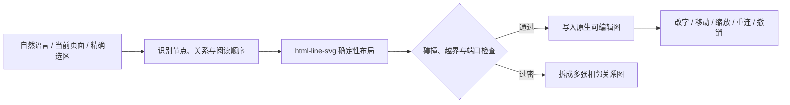

# Yogurt AI

<p align="center">
  
</p>

<p align="center"><strong>说出你想表达的结构，AI 直接生成一张真正能继续编辑的图。</strong></p>

<p align="center">Excalidraw 风格 · 原生可编辑 · Codex Agent 驱动 · 本地项目持久化</p>

<p align="center">
  <a href="README.en.md">English</a> ·
  <a href="#windows-桌面应用">Windows 下载</a> ·
  <a href="#如何使用">快速开始</a> ·
  <a href="#本地开发">本地开发</a>
</p>

Yogurt AI 把一段自然语言、当前页面或精确选区，转换成 Excalidraw 风格的原生关系图。结果不是一张图片，也不是一个无法拆开的 SVG：卡片、文字、分区和箭头都是画布里的真实对象，可以逐项移动、改字、缩放、删除和重新连接。

<p align="center">
  
</p>
<p align="center"><sub>原生画布结果：节点、标签、分区与绑定箭头都能继续编辑。</sub></p>

## 一句话完成什么

```text
把登录、权限校验、失败回退和重试机制画成一张可编辑流程图。
```

Yogurt AI 会完成四件事：

1. 读取当前页面或选区中的真实文字和稳定对象 ID。
2. 提炼唯一核心判断，识别节点、关系、状态与阅读顺序。
3. 使用 `html-line-svg` 语义与布局规则计算层级、间距、端口和避障路径。
4. 先 dry-run 检查碰撞与越界，再把原生对象写入当前画布。



## 真正可编辑，而不只是“看起来像”

| 能力 | Yogurt AI 的结果 |
| --- | --- |
| 节点 | 原生 tldraw geo shape，双击即可修改中英文文字 |
| 连线 | 原生 arrow，并与起点、终点保持真实 binding |
| 分区 | 原生 frame；移动分区时子节点一起移动 |
| 样式 | 手绘 `draw` 描边与字体、透明或可选 hachure 填充、中性黑色主路径 |
| 布局 | 按阅读顺序分层；同级对齐；标签、节点与长连线避障 |
| 修改 | 用户手改过的文字会成为下一轮 AI 的最新上下文，不会被旧 metadata 覆盖 |
| 追溯 | 每个对象保留稳定 semantic ID 与来源 shape ID |
| 安全写入 | dry-run 与 revision 校验通过后才提交；可使用受保护的 Agent 撤销 |

主流程默认只生成原生可编辑图。复杂需求会拆成多张相邻的图，不会降级成位图、整页视觉预演、HTML/SVG 图块或 PRD 页面。

## 如何使用

### 1. 打开一个项目

从桌面快捷方式打开 Yogurt AI，首次启动时选择项目文件夹。画布数据会保存在该项目的 `canvas/` 目录。

### 2. 描述你想画的内容

展开右下角 Codex Agent，直接输入需求，或点击唯一快捷任务 `生成可编辑图`。

没有选中对象时，Agent 使用当前整页作为语义来源；有选区时，只读取冻结的选区范围，并把新图放在来源旁边。

可直接尝试：

```text
画出“用户提交需求 → AI 识别意图 → 生成草稿 → 用户修改 → 再生成”的闭环。
```

```text
把选中的卡片整理成从左到右的系统架构图，主链路用实义箭头，
异常路径用虚线，保留我已经改过的文字。
```

```text
这张图太挤了。保持对象 ID 和文字不变，重新排版并让箭头避开节点。
```

### 3. 在画布里继续编辑

- 双击卡片修改文字；
- 拖动节点，绑定箭头会跟随；
- 使用样式面板修改颜色、填充和线型；
- 框选或 Shift 多选后整体移动；
- 使用画布撤销/重做处理手工编辑；
- 圈选已有图后，继续让 Agent 补节点、改关系或重新布局。

## Windows 桌面应用

普通用户不需要安装 Node.js、Git 或全局 Codex CLI。

1. 从 [GitHub Releases 下载 Yogurt AI Beta 0.2.13](https://github.com/suud003/Cowart/releases/tag/v0.2.13%2Bcodex.20260901) 的 `Yogurt-AI-Beta-Setup-0.2.13-x64.exe`。
2. 双击安装包并完成安装。
3. 首次打开时选择项目文件夹。
4. 展开 Codex Agent；如果尚未登录，点击“登录 Codex”并在官方浏览器页面完成授权。

当前 Beta 安装包尚未进行代码签名，Windows SmartScreen 可能显示保护提示。请只从本仓库 Releases 下载，并核对 Release 页面公布的 SHA-256。

## Codex 插件

```bash
git clone https://github.com/suud003/Cowart.git
cd Cowart
npm install
npm run build
codex plugin marketplace add .
codex plugin add cowart-thinking-canvas@cowart-thinking-github
```

安装后可以这样开始：

```text
打开 Yogurt AI，把当前需求生成成 Excalidraw 风格的原生可编辑图。
```

插件的默认 Agent 是 `cowart-semantic-diagram`。图片、整页编排、PRD、HTML 与 Slides 能力不会隐式抢占普通画图请求。

## 本地开发

```bash
npm install
npm run dev
npm run build
npm run desktop
```

也可以显式指定桌面应用工作区：

```powershell
$env:YOGURT_WORKSPACE_ROOT = 'D:\path\to\your-project'
npm run desktop
```

完整校验：

```bash
npm run check
npm test
npm run build
```

本地 Vite 页面只用于画布 UI 开发；`npm run desktop` 才会启动带 Codex Agent 桥接的完整桌面体验。更多桌面实现与排错信息见 [desktop/README.md](desktop/README.md)。

## 数据与安全

- 画布数据保存在当前项目的 `canvas/pages/<page-id>/`。
- 生成图使用稳定对象 ID、来源 shape ID 与 snapshot revision，避免按截图坐标错位。
- 普通新增与更新使用安全 operation 工具；删除用户内容或编辑非 Agent 对象需要更高权限。
- 自动模式只连续完成当前工作区内的可逆画布操作，不会自动放行外部授权、凭据、付费或破坏性动作。
- 桌面应用通过本机 stdio 连接 Codex App Server，不调用 `chatgpt.com/backend-api/...` 内部接口。
- 未来若增加直接模型 API 集成，将使用公开的 `https://api.openai.com/v1/responses` 与 API Key 鉴权。

## 技术与致谢

Yogurt AI 使用 [tldraw](https://github.com/tldraw/tldraw) 作为原生无限画布与编辑运行时，并参考 [Excalidraw](https://github.com/excalidraw/excalidraw) 的手绘视觉语言、工具交互和箭头绑定体验。Excalidraw 是设计参考，不是本项目运行时依赖。

- `cowart-semantic-diagram`：将来源内容转换为原生可编辑语义图；
- `html-line-svg`：提供 teaching claim、关系语法、阅读顺序、层级、间距、端口与避障规则；
- Excalifont、Xiaolai 与 Assistant 字体采用 SIL Open Font License 1.1；
- tldraw 使用其独立许可，公开或商业分发前需配置适用 license key，详见 [licenses/TLDRAW-LICENSE.md](licenses/TLDRAW-LICENSE.md)。

本仓库是 [zhongerxin/Cowart](https://github.com/zhongerxin/Cowart) 的公开 Fork，当前维护于 [suud003/Cowart](https://github.com/suud003/Cowart)。完整第三方说明见 [THIRD_PARTY_NOTICES.md](THIRD_PARTY_NOTICES.md)。

## 开发者

ZHONG XIN  
zhongxin123456@gmail.com  
https://www.jiqiren.ai
