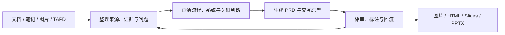

# Yogurt AI

<p align="center">
  
</p>

<p align="center"><strong>把零散材料变成看得见、改得动、交付得出去的产品思考画布。</strong></p>

<p align="center">
  <a href="README.en.md">English</a> ·
  <a href="#从灵感到可交付成果">产品体验</a> ·
  <a href="#核心能力">核心能力</a> ·
  <a href="#完整案例ai-互动影游">完整案例</a> ·
  <a href="#安装">安装</a> ·
  <a href="#三分钟上手">快速开始</a>
</p>

Yogurt AI 是运行在 Codex 中的 AI 思考与产品创作画布。你可以把文档、笔记、图片、对话和可访问的 TAPD 内容直接交给它，在同一个可编辑工作区里梳理证据与观点、画清系统关系、生成 PRD 和交互原型、完成评审标注，再把结果整理成图片、HTML、Slides 或 PowerPoint。

它不是只给你一张静态结果图。卡片、分区、连线、原型和创作内容都可以继续圈选、拖拽、追问和修改，重要变更还支持预演与安全撤销。

<p align="center">
  
</p>
<p align="center"><sub>从来源材料、行为观察和待回答问题出发，逐步形成假设与下一步实验。</sub></p>

## 从灵感到可交付成果



| 你正在做的事 | Yogurt AI 帮你完成 | 你可以继续做什么 |
| --- | --- | --- |
| 消化研究、会议和需求材料 | 提取带来源的卡片，区分事实、观点、假设和问题 | 聚类、连线、追问，逐步长成知识全景 |
| 解释一个复杂流程或系统 | 提炼核心判断，生成可编辑框线图与清晰阅读顺序 | 移动节点、改写关系、补充状态和例外 |
| 把产品想法变成方案 | 生成 shaping、模块 PRD 和可交互页面 | 在真实界面上标注、对照需求评审并回流画布 |
| 制作视觉内容与汇报 | 生成或修改图片、HTML 和 Slides | 演示、下载，或整合为全景 HTML 和 PowerPoint |

## 核心能力

### 1. 在画布上整理真实材料

把文档、图片和笔记导入画布后，Yogurt AI 会保留来源路径与原文摘录，并把 Agent 的总结和推断分开记录。你可以像使用白板一样组织卡片、关系、分区和手绘标注，也可以让 Agent 围绕一个问题自动搭建全景结构。

当你只想修改局部时，使用 `AI 圈选` 圈住相关对象，再用箭头、划掉、分组或文字说明意图。Agent 会结合选区内容和标注完成局部调整，圈外内容保持不动。


### 2. 把复杂关系画成可编辑框线图

选择一组材料，点击 `生成画布框线图`，Yogurt AI 会先找出这张图最应该表达的核心判断，再组织对象、状态、关系和阅读顺序。默认结果由原生卡片、语义分区和绑定连线组成，每个元素都能单独选择、移动、改字和继续连接。

布局支持横向、纵向、反向、中心辐射和主板到分支等结构，并能区分主路径、备选路径、双向同步、无向关联与包含关系。需要精确端口、密集避障或细粒度泳道时，也可以生成经过安全校验的 HTML + inline SVG 图块。


[查看画布框线图案例、可复用 Prompt 与语义规格](examples/semantic-diagram/ai-interactive-film-system/)

### 3. 从零散想法生成 PRD 与交互原型

选中产品相关的画布区域，点击 `生成交互 PRD`。Yogurt AI 会结合当前对话、选区或整页内容、产品假设，以及已授权并成功读取的 TAPD 正文，生成可追溯的 shaping 文档、模块 PRD 和自包含交互原型。

评审不再依赖容易漂移的截图坐标：标注会锚定在真实界面元素上，你可以一边操作原型，一边对照 PRD 留下意见。评审完成后，Yogurt AI 会先展示回流预览；确认后，再把结论写回原始画布中的产品分区、卡片和关系。


[查看完整 Product Bridge 案例、PRD、原型与运行说明](examples/product-bridge/ai-interactive-film-case/)

### 4. 创作内容，并把整张画布带走

Yogurt AI 的创作与交付工具都在同一个菜单中：

| 能力 | 适合的任务 | 结果 |
| --- | --- | --- |
| AI 图片 | 从 prompt 和参考图生成视觉稿；根据画布标注修图 | 新图片放回指定位置，原图与标注保留 |
| AI HTML | 生成可运行的数据看板、解释页或交互内容 | 单文件 HTML 嵌入画布，可继续编辑与下载 |
| AI Slides | 从主题和参考素材生成连贯演示 | 可在 Yogurt AI 中预览、切页和全屏播放 |
| 整合导出 | 汇总当前页面的卡片、连线、图片、HTML 与手绘内容 | 可缩放全景 HTML，或可继续编辑的 PowerPoint |

<table>
  <tr>
    <td width="50%"><br><strong>AI 图片</strong>：结合 prompt、参考图和画布位置生成视觉稿。</td>
    <td width="50%"><br><strong>按标注修改图片</strong>：保留原始素材，在旁边生成干净修订版。</td>
  </tr>
  <tr>
    <td width="50%"><br><strong>AI HTML</strong>：把想法直接做成可运行、可继续编辑的交互内容。</td>
    <td width="50%"><br><strong>AI Slides</strong>：生成连贯页面，并在画布中直接演示。</td>
  </tr>
  <tr>
    <td width="50%"><br><strong>HTML 全景</strong>：把当前画布整合成带目录的独立文件。</td>
    <td width="50%"><br><strong>PowerPoint 导出</strong>：保留全景、目录和可编辑的原生文字。</td>
  </tr>
</table>

## 完整案例：AI 互动影游

“分岔回声”展示了一条完整的产品旅程：从一句“让玩家用选择或自然语言推动电影剧情”的想法出发，先在 Yogurt AI 中梳理创作者约束、玩家行动、AI 导演、安全闸门和状态账本，再生成产品文档与五个可交互页面，最后在真实原型上完成标注与回流。

| 阶段 | 案例产物 |
| --- | --- |
| 梳理系统 | 一张原生可编辑的 AI 互动影游系统框线图 |
| 定义产品 | shaping、AI 叙事引擎、玩家体验和创作者工作室 PRD |
| 验证体验 | 作品发现、互动播放、可解释结局、故事编排、发布检查 5 个页面 |
| 评审方案 | 原型与 PRD 同屏，14 个稳定标注锚点，页面关系可视化 |
| 回到思考 | 将确认后的结论整理回 Yogurt 产品分区，继续迭代 |

<table>
  <tr>
    <td width="50%"><br><strong>从产品结构看到完整页面链路</strong></td>
    <td width="50%"><br><strong>再把体验做成可交互页面</strong></td>
  </tr>
</table>

[浏览完整产品案例](examples/product-bridge/ai-interactive-film-case/) · [浏览画布框线图案例](examples/semantic-diagram/ai-interactive-film-system/)

## 安装

需要 Node.js 与 Git。使用 Codex CLI 安装插件；完整交互画布请在 Codex 桌面端使用。运行：

```bash
git clone https://github.com/suud003/Cowart.git
cd Cowart
npm install
npm run build
codex plugin marketplace add <Cowart-绝对路径>
codex plugin add cowart-thinking-canvas@cowart-thinking-github
codex plugin list
```

安装后可在 Codex CLI 输入 `/plugins` 确认 Yogurt AI 已启用，再开启一个新任务，让 Skill 和画布工具完整加载。更多安装方式见 [Codex Plugins 文档](https://learn.chatgpt.com/docs/plugins)。

## 三分钟上手

### 1. 打开画布

在新的 Codex 任务中说：

```text
打开这个项目的 Yogurt AI 画布。
```

### 2. 放入材料，长出第一张图

把文档、图片或笔记放进当前项目，然后说：

```text
把 docs/research 里的材料整理到 Yogurt AI。
保留来源和关键原文，先区分证据、假设和待确认问题，
再围绕“用户为什么会放弃这个流程”生成一张可编辑全景图。
```

### 3. 选择下一步成果

直接圈选画布内容，或打开右上角 `Yogurt AI` 菜单：

- 想解释流程与系统：选择 `生成画布框线图`。
- 想推进产品方案：选择 `生成交互 PRD`。
- 想做视觉内容：创建 `AI 图片`、`AI HTML` 或 `AI Slides`。
- 想分享成果：选择 `整合为 HTML` 或 `整合为 PowerPoint`。


## 数据、来源与安全

- 画布数据保存在当前项目的 `canvas/pages/<page-id>/`；页面图片与 HTML 保存在对应的 `assets/` 目录。
- 来源路径、原文摘录和 Agent 总结分开保存，便于判断哪些内容来自材料，哪些属于分析与推断。
- TAPD 等外部链接只有在用户环境中的授权连接器实际返回正文后，才会作为已读取材料；未授权链接不会被推测成需求。
- 复杂变更会先展示预览，确认画布仍处于预期状态后再一次性写入，并保留安全撤销能力。
- 精确 SVG 图块在写入画布前会经过结构与脚本安全校验。
- 项目外文件只有在用户明确允许时，才会复制到画布材料目录。

## 技术信息

<details>
<summary><strong>内置 Skills 与工作区校验</strong></summary>

- `cowart-thinking-canvas:cowart-thinking-agent`：整理来源、构建思考空间、预演和应用局部修改。
- `cowart-thinking-canvas:cowart-semantic-diagram`：在当前画布生成和修订可追溯框线图。
- `cowart-thinking-canvas:cowart-product-bridge`：把产品材料转换为 PRD 与交互原型，并处理评审回流。
- `cowart-thinking-canvas:cowart-image-gen` / `cowart-image-edit`：生成图片和执行标注驱动修订。
- `cowart-thinking-canvas:cowart-open-canvas`：打开当前项目的 Yogurt AI 原生画布。

校验生成的 Product Bridge 工作区：

```powershell
python -B -X utf8 skills/cowart-product-bridge/scripts/validate_workspace.py <workspace> --strict
python -B -X utf8 skills/cowart-product-bridge/scripts/serve.py <workspace>
```

校验精确 SVG 框线图：

```powershell
node skills/cowart-semantic-diagram/scripts/validate-semantic-svg.mjs --root <artifact-root> <diagram.html>
```

</details>

<details>
<summary><strong>本地开发</strong></summary>

```bash
npm install
npm run dev
npm run build
```

也可以为指定用户项目启动 Vite 画布预览：

```bash
./scripts/start-canvas.sh /path/to/user/project
```

本地 Vite 页面用于 UI 开发，不包含 Codex Agent 消息桥。直接发送 AI 圈选、生成框线图和 Product Bridge 请求，请使用 Codex 中的 Yogurt AI 原生画布。

常用环境变量：

- `COWART_PORT`：本地服务端口，默认 `43217`。
- `COWART_PROJECT_DIR`：拥有画布数据的用户项目目录。
- `COWART_CANVAS_DIR`：画布数据目录，默认 `$COWART_PROJECT_DIR/canvas`。

</details>

## 开发者

ZHONG XIN  
zhongxin123456@gmail.com  
https://www.jiqiren.ai

## 开源、许可与致谢

本仓库是 [zhongerxin/Cowart](https://github.com/zhongerxin/Cowart) 的公开 Fork，保留 GitHub Fork 关系和上游 MIT 许可；当前公开版本维护在 [`suud003/Cowart`](https://github.com/suud003/Cowart)。

- [tldraw/tldraw](https://github.com/tldraw/tldraw) 提供无限画布、形状编辑与交互运行时。项目固定使用 `5.1.1`；tldraw 使用其独立许可，公开生产部署需要适用的试用、商业或其他授权。详见 [`licenses/TLDRAW-LICENSE.md`](licenses/TLDRAW-LICENSE.md)。
- [excalidraw/excalidraw](https://github.com/excalidraw/excalidraw) 是工具栏布局、手绘视觉语言与交互细节的设计参考，并非运行时依赖。
- Excalifont、Xiaolai 和 Assistant 字体使用 SIL Open Font License 1.1。详见 [`src/assets/fonts/FONT-LICENSES.md`](src/assets/fonts/FONT-LICENSES.md)。
- [PptxGenJS](https://github.com/gitbrent/PptxGenJS) 用于在浏览器中生成标准 `.pptx` 文件，采用 MIT 许可。

根目录 `LICENSE` 仅覆盖上游 Cowart 代码和本 Fork 中采用 MIT 许可的部分，不覆盖第三方组件。完整说明见 [`THIRD_PARTY_NOTICES.md`](THIRD_PARTY_NOTICES.md)。
