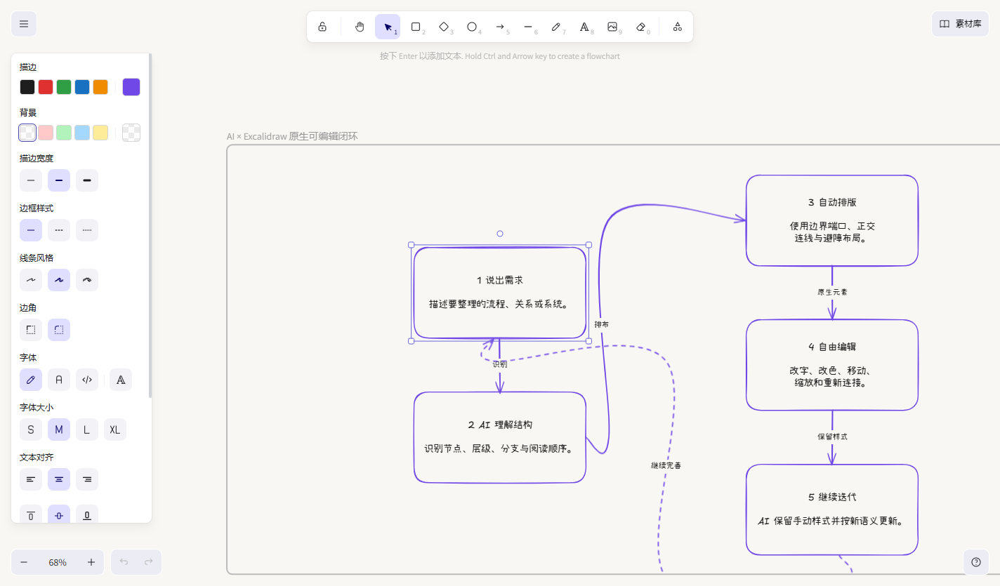
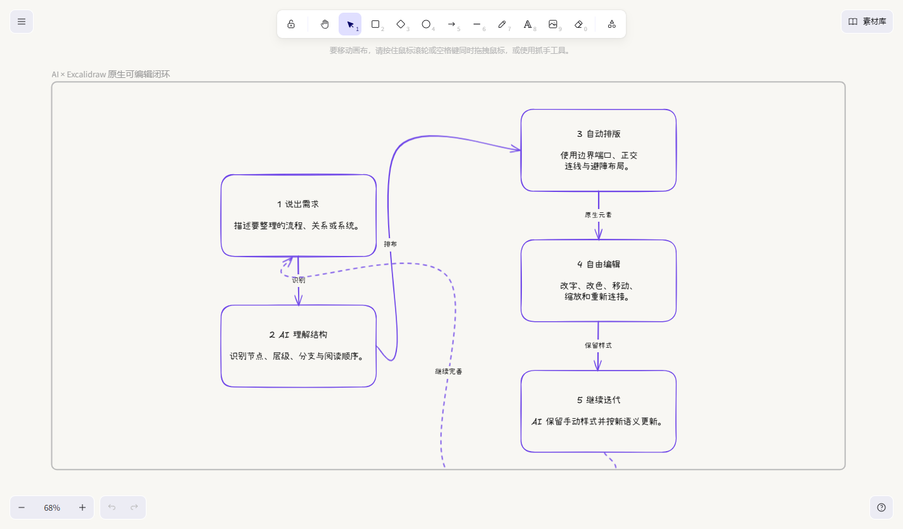
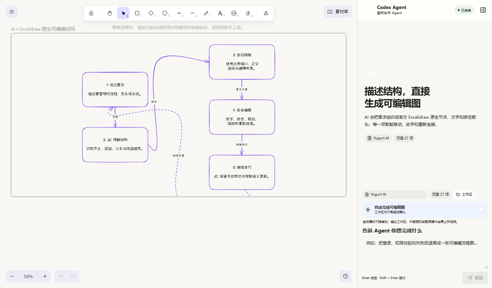

# Yogurt AI

<p align="center">
  
</p>

<p align="center"><strong>官方 Excalidraw 编辑器，需要时再打开 AI。</strong></p>

<p align="center">官方 Excalidraw 编辑器 · 多画布项目树 · AI 生成原生可编辑图 · Codex Agent · 项目本地保存</p>

<p align="center">
  <a href="README.en.md">English</a> ·
  <a href="#windows-桌面应用">Windows 下载</a> ·
  <a href="#如何使用">快速开始</a> ·
  <a href="#本地开发">本地开发</a>
</p>

Yogurt AI 内嵌官方 [`@excalidraw/excalidraw`](https://www.npmjs.com/package/@excalidraw/excalidraw) runtime 与 UI。关闭 AI 时，编辑器、工具栏、快捷键、样式面板与 `.excalidraw` 数据模型仍由官方组件提供；项目画布导航则放在 Excalidraw 官方 Sidebar 中。

需要 AI 时，通过应用菜单或快捷键打开 Codex Agent。Agent 生成的卡片、文字、分区和绑定箭头仍然是 Excalidraw 原生元素，可以继续选择、移动、改字、改色、缩放、重连、撤销和导出。

<p align="center">
  
</p>

## 两种模式，同一个多画布项目

### AI 关闭：官方 Excalidraw 编辑体验

- 编辑器、工具栏、快捷键和样式面板保持官方 Excalidraw 体验；
- 项目画布导航由 Excalidraw 官方 Sidebar 承载，不显示 AI 面板或预制提示词；
- 使用官方选择、手绘、矩形、菱形、椭圆、箭头、文字、图片、橡皮擦和画框工具；
- 选中元素后，通过官方样式面板调整字体、字号、文字色、描边色、填充色、线宽、线型、粗糙度、透明度与箭头样式；
- 保留 Excalidraw 的撤销/重做、缩放、快捷键、导入导出和原生编辑体验。
- 可将当前选区或整张画布直接复制为 PNG，并粘贴到聊天、文档或设计工具中。

<p align="center">
  
</p>

### AI 开启：Excalidraw + Codex Agent

从系统菜单选择 `Yogurt AI → 切换 AI 模式`，或按：

- Windows / Linux：`Ctrl + Shift + A`
- macOS：`Cmd + Shift + A`

Agent 面板会在同一个编辑器旁打开；关闭后立即回到纯净画布。

<p align="center">
  
</p>

## 一个项目，多张画布

每个项目可以包含多张彼此独立的 Excalidraw 画布，并在官方 Sidebar 中按父子关系组织成树。打开画布导航：

- Windows / Linux：`Ctrl + Shift + O`
- macOS：`Cmd + Shift + O`

可以创建根画布或子画布、切换、重命名、调整父子位置，以及删除不再需要的画布。删除仍有子画布的父节点时，子画布会自动提升到被删节点的上一级，内容不会随父节点一起消失。

每张画布独立保存自己的场景与 revision；在一张画布中编辑或运行 Agent，不会覆盖同一项目里的其他画布。

## AI 生成的也是 Excalidraw 原生元素

| 内容 | 生成结果 |
| --- | --- |
| 卡片 | 原生 `rectangle` 与绑定文字 |
| 分区 | 原生 `frame`，用于组织一组相关元素 |
| 关系 | 原生 `arrow`，绑定起点、终点与可编辑标签 |
| 布局 | 自动处理阅读顺序、层级、间距、端口与避障 |
| 样式 | 完整交给 Excalidraw 官方样式面板继续编辑 |
| 后续修改 | AI 更新语义时保留用户已调整的字体、颜色、线框和几何位置 |
| 追溯 | AI 元素保留稳定 semantic ID 与来源信息，便于继续整理 |

每个生成元素都可以独立选择与编辑，并继续使用 Excalidraw 的移动、样式、绑定、撤销和导出能力。

## 如何使用

1. 从桌面快捷方式打开 Yogurt AI，首次启动时选择一个项目文件夹。
2. 按 `Ctrl + Shift + O` 打开画布导航；需要时创建根画布或子画布，并在项目树中切换和整理。
3. 直接使用 Excalidraw 绘图；需要调整样式时，选中元素并使用官方样式面板。
4. 需要 AI 时，按 `Ctrl + Shift + A`，或从 `Yogurt AI` 菜单开启 AI 模式。
5. 描述要生成或整理的结构，例如：

```text
把“用户提交需求 → AI 识别意图 → 生成草稿 → 用户修改 → 再生成”
画成从左到右的可编辑闭环，并为失败路径使用虚线。
```

```text
整理选中的卡片：保留我改过的文字与颜色，重新分层，
让箭头避开节点，并把异常流程放到单独的画框中。
```

6. 关闭 AI 模式，继续使用完整的 Excalidraw 工具编辑、导出或分享文件。

当前 Beta 专注于“官方 Excalidraw 编辑器 + 多画布项目树 + AI 生成原生可编辑图”。

## Windows 桌面应用

普通用户不需要安装 Node.js、Git 或全局 Codex CLI。

1. 从 [GitHub Releases 下载 Yogurt AI Beta 0.4.1](https://github.com/suud003/Cowart/releases/tag/v0.4.1%2Bcodex.20260902) 的 `Yogurt-AI-Beta-Setup-0.4.1-x64.exe`。
2. 双击安装包并完成安装。
3. 首次打开时选择项目文件夹。
4. 按 `Ctrl + Shift + A` 打开 Codex Agent；如果尚未登录，请在官方浏览器页面完成 Codex 授权。

当前 Beta 安装包尚未进行代码签名，Windows SmartScreen 可能显示保护提示。请只从本仓库 Releases 下载，并核对 Release 页面公布的 SHA-256。

## Codex 插件

```bash
git clone https://github.com/suud003/Cowart.git
cd Cowart
npm install
npm run build
codex plugin marketplace add .
codex plugin add cowart-thinking-canvas@cowart-thinking-github
```

安装后可以直接描述要生成的图：

```text
打开 Yogurt AI，把当前需求整理成一张原生可编辑的 Excalidraw 流程图。
```

`cowart-semantic-diagram` 会把结构写成 Excalidraw 原生元素，并使用 `html-line-svg` 的布局规则保持层级、间距和连线可读。

## 本地开发

```bash
npm install
npm run dev
npm run build
npm run desktop
```

也可以显式指定桌面应用工作区：

```powershell
$env:YOGURT_WORKSPACE_ROOT = 'D:\path\to\your-project'
npm run desktop
```

完整校验：

```bash
npm run check
npm test
npm run build
```

本地 Vite 页面用于编辑器 UI 开发；`npm run desktop` 会启动带 Codex Agent 桥接的完整桌面应用。更多桌面实现与排错信息见 [desktop/README.md](desktop/README.md)。

## 数据与安全

- 项目树与当前画布记录在 `canvas/project.json`。
- 每张画布独立保存在 `canvas/canvases/<canvasId>/scene.excalidraw`，内容采用标准 Excalidraw 文档结构。
- 使用旧版 `canvas/yogurt.excalidraw` 的项目会在首次打开时按需自动迁移；原文件会保留，画布内容原样复制到新的默认画布。
- 每张画布分别使用 revision 校验与原子写入，避免不同画布互相覆盖，也避免同一画布的过期更新静默覆盖最新版本。
- AI 操作写入原生元素；用户手动调整后的字体、颜色、线条与位置会成为后续操作的最新状态。
- 自动模式只连续完成当前工作区内的可逆画布操作，不会自动放行外部授权、凭据、付费或破坏性动作。
- 桌面应用通过本机 stdio 连接 Codex App Server。

## 技术与致谢

Yogurt AI 使用官方 [Excalidraw](https://github.com/excalidraw/excalidraw) React 包作为编辑器与画布运行时，而不是重新实现一套相似界面。

- `@excalidraw/excalidraw`：官方编辑器 UI、工具、原生元素模型、样式面板与序列化能力；
- `cowart-semantic-diagram`：将来源内容转换为原生可编辑语义图；
- `html-line-svg`：提供关系语法、阅读顺序、层级、间距、端口与避障规则；
- Excalifont、Xiaolai 与 Assistant 字体采用 SIL Open Font License 1.1；
- Excalidraw 使用 MIT License，详见 [licenses/EXCALIDRAW-LICENSE.md](licenses/EXCALIDRAW-LICENSE.md)。

本仓库是 [zhongerxin/Cowart](https://github.com/zhongerxin/Cowart) 的公开 Fork，当前维护于 [suud003/Cowart](https://github.com/suud003/Cowart)。完整第三方说明见 [THIRD_PARTY_NOTICES.md](THIRD_PARTY_NOTICES.md)。

## 维护

Yogurt AI 由 [suud003/Cowart](https://github.com/suud003/Cowart) 维护，并保留原项目作者与许可证信息。
