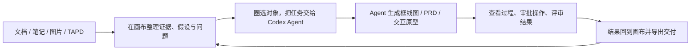

# Yogurt AI

<p align="center">
  
</p>

<p align="center"><strong>在画布里想清楚，交给 Codex Agent 做出来，再把结果带回画布继续迭代。</strong></p>

<p align="center"><strong>Yogurt AI Desktop · Beta</strong> · 本地优先 · 可编辑画布 · Codex Agent 桥接</p>

<p align="center">
  <a href="README.en.md">English</a> ·
  <a href="#一条完整的产品工作流">产品体验</a> ·
  <a href="#核心体验">核心体验</a> ·
  <a href="#完整案例ai-互动影游">完整案例</a> ·
  <a href="#安装并启动桌面应用beta">桌面应用</a> ·
  <a href="#三分钟上手">快速开始</a>
</p>

Yogurt AI 是一个可安装的 AI 产品工作台，同时提供独立桌面应用和 Codex 插件。它把 tldraw 原生无限画布与 Codex Agent 放进同一个界面：你可以把文档、笔记、图片、对话和已授权的 TAPD 内容放到画布上，圈选一组真实对象，直接让 Agent 梳理材料、补全产品结构、生成框线图、PRD 或交互原型。

Agent 会读取当前页面和稳定对象 ID，持续回传执行状态、计划与修改摘要；遇到敏感操作时，审批就在工作台内完成。结果仍然是可选择、可拖拽、可改写、可追问的画布对象，而不是一张无法继续工作的静态图。画布由此既是思考的起点，也是 Agent 工作后的统一归档。

<p align="center">
  
</p>
<p align="center"><sub>原生画布与 Codex Agent 工作台处于同一窗口，共享当前项目、页面与对象上下文。</sub></p>

## 一条完整的产品工作流



| 从哪里开始 | Codex Agent 如何参与 | 最终留下什么 |
| --- | --- | --- |
| 零散研究、会议记录与需求链接 | 按来源整理事实、观察、假设和待确认问题 | 可继续聚类、连线和追问的知识全景 |
| 一组画布卡片或一个待解释系统 | 读取当前页与精确选区，规划并生成语义结构 | 原生可编辑的卡片、分区和绑定连线 |
| 一个还不完整的产品想法 | 补齐约束与验收标准，生成 PRD 和可交互页面 | 可评审、可标注、可回流的产品工作区 |
| 已完成的整张画布 | 汇总卡片、图片、HTML、Slides 与手绘内容 | 可分享 HTML 全景或可编辑 PowerPoint |

## 核心体验

### 1. 画布与 Codex Agent 共用同一份上下文

桌面应用右侧是常驻的 Codex Agent 工作台。它知道当前项目、页面、选中对象和它们的稳定 ID；发送任务前会先保存最新画布，因此 Agent 处理的是你眼前的真实内容，而不是一张容易错位的截图。

你可以直接输入要求，也可以从 `整理选区`、`生成 PRD`、`生成框线图` 开始。执行过程中，工作台会持续显示回复、计划、修改摘要和任务状态；你可以批准或拒绝受控操作，也可以随时中断。再次打开同一个项目时，桌面应用会继续使用该项目已保存的 Agent 会话。

把文档、图片和笔记导入画布后，Yogurt AI 会保留来源路径与原文摘录，并把 Agent 的总结和推断分开记录。你可以像使用白板一样组织卡片、关系、分区和手绘标注，也可以让 Agent 围绕一个问题自动搭建全景结构。

当你只想修改局部时，使用 `AI 圈选` 圈住相关对象，再用箭头、划掉、分组或文字说明意图。Agent 会结合选区内容和标注完成局部调整，圈外内容保持不动。

<table>
  <tr>
    <td width="50%"><br><strong>让材料长成结构</strong>：从来源、观察和问题出发，形成假设与下一步实验。</td>
    <td width="50%"><br><strong>只改需要推进的部分</strong>：圈选对象并添加批注，圈外内容保持不动。</td>
  </tr>
</table>

### 2. 把复杂关系画成可编辑框线图

选择一组材料，点击 `生成画布框线图`，Yogurt AI 会先找出这张图最应该表达的核心判断，再组织对象、状态、关系和阅读顺序。默认结果由原生卡片、语义分区和绑定连线组成，每个元素都能单独选择、移动、改字和继续连接。

布局支持横向、纵向、反向、中心辐射和主板到分支等结构，并能区分主路径、备选路径、双向同步、无向关联与包含关系。需要精确端口、密集避障或细粒度泳道时，也可以生成经过安全校验的 HTML + inline SVG 图块。


[查看画布框线图案例、可复用 Prompt 与语义规格](examples/semantic-diagram/ai-interactive-film-system/)

### 3. 从零散想法生成 PRD 与交互原型

选中产品相关的画布区域，点击 `生成交互 PRD`。Yogurt AI 会结合当前对话、选区或整页内容、产品假设，以及已授权并成功读取的 TAPD 正文，生成可追溯的 shaping 文档、模块 PRD 和自包含交互原型。

评审不再依赖容易漂移的截图坐标：标注会锚定在真实界面元素上，你可以一边操作原型，一边对照 PRD 留下意见。评审完成后，Yogurt AI 会先展示回流预览；确认后，再把结论写回原始画布中的产品分区、卡片和关系。


[查看完整 Product Bridge 案例、PRD、原型与运行说明](examples/product-bridge/ai-interactive-film-case/)

### 4. 创作内容，并把整张画布带走

Yogurt AI 的创作与交付工具都在同一个菜单中：

| 能力 | 适合的任务 | 结果 |
| --- | --- | --- |
| AI 图片 | 从 prompt 和参考图生成视觉稿；根据画布标注修图 | 新图片放回指定位置，原图与标注保留 |
| AI HTML | 生成可运行的数据看板、解释页或交互内容 | 单文件 HTML 嵌入画布，可继续编辑与下载 |
| AI Slides | 从主题和参考素材生成连贯演示 | 可在 Yogurt AI 中预览、切页和全屏播放 |
| 整合导出 | 汇总当前页面的卡片、连线、图片、HTML 与手绘内容 | 可缩放全景 HTML，或可继续编辑的 PowerPoint |

<table>
  <tr>
    <td width="50%"><br><strong>AI 图片</strong>：结合 prompt、参考图和画布位置生成视觉稿。</td>
    <td width="50%"><br><strong>按标注修改图片</strong>：保留原始素材，在旁边生成干净修订版。</td>
  </tr>
  <tr>
    <td width="50%"><br><strong>AI HTML</strong>：把想法直接做成可运行、可继续编辑的交互内容。</td>
    <td width="50%"><br><strong>AI Slides</strong>：生成连贯页面，并在画布中直接演示。</td>
  </tr>
  <tr>
    <td width="50%"><br><strong>HTML 全景</strong>：把当前画布整合成带目录的独立文件。</td>
    <td width="50%"><br><strong>PowerPoint 导出</strong>：保留全景、目录和可编辑的原生文字。</td>
  </tr>
</table>

## 完整案例：AI 互动影游

“分岔回声”展示了一条完整的产品旅程：从一句“让玩家用选择或自然语言推动电影剧情”的想法出发，先在 Yogurt AI 中梳理创作者约束、玩家行动、AI 导演、安全闸门和状态账本，再生成产品文档与五个可交互页面，最后在真实原型上完成标注与回流。

| 阶段 | 案例产物 |
| --- | --- |
| 梳理系统 | 一张原生可编辑的 AI 互动影游系统框线图 |
| 定义产品 | shaping、AI 叙事引擎、玩家体验和创作者工作室 PRD |
| 验证体验 | 作品发现、互动播放、可解释结局、故事编排、发布检查 5 个页面 |
| 评审方案 | 原型与 PRD 同屏，14 个稳定标注锚点，页面关系可视化 |
| 回到思考 | 将确认后的结论整理回 Yogurt 产品分区，继续迭代 |

<table>
  <tr>
    <td width="50%"><br><strong>从产品结构看到完整页面链路</strong></td>
    <td width="50%"><br><strong>再把体验做成可交互页面</strong></td>
  </tr>
</table>

[浏览完整产品案例](examples/product-bridge/ai-interactive-film-case/) · [浏览画布框线图案例](examples/semantic-diagram/ai-interactive-film-system/)

## 安装并启动桌面应用（Beta）

Yogurt AI Desktop 当前面向本地试用与开发验证。它会在本机启动画布和 Codex Agent 桥接，项目材料、画布数据与会话引用都保存在你选择的工作区中。

### 准备环境

- Node.js、npm 与 Git。
- 已安装并完成登录的 Codex CLI。
- Windows 用户推荐通过 npm 全局安装并保留默认位置，桌面应用会从中自动找到 Codex CLI。

```bash
npm install -g @openai/codex
codex login
git clone https://github.com/suud003/Cowart.git
cd Cowart
npm install
npm run desktop
```

`npm run desktop` 会先构建前端，再打开 Yogurt AI 桌面窗口。默认工作区是当前目录；如果希望它为另一个产品项目保存画布并运行 Agent，请先指定项目目录。

PowerShell：

```powershell
$env:YOGURT_WORKSPACE_ROOT = 'D:\path\to\your-product'
npm run desktop
```

macOS / Linux：

```bash
YOGURT_WORKSPACE_ROOT=/path/to/your-product npm run desktop
```

如果 Windows 没有自动找到 Codex CLI，可以显式指定 npm 安装的入口：

```powershell
$env:YOGURT_CODEX_JS = "$env:APPDATA\npm\node_modules\@openai\codex\bin\codex.js"
npm run desktop
```

桌面桥接基于仍处于实验阶段的 [Codex App Server](https://learn.chatgpt.com/docs/app-server)。升级 Codex CLI 后，建议先运行 `npm run probe:desktop` 完成兼容性检查；面向正式分发时，应固定并验证配套 Codex 版本。实现与故障排查见 [`desktop/README.md`](desktop/README.md)。

### 启用完整 Yogurt AI 工作流（推荐）

桌面应用已经自带画布读写桥接。要同时启用本仓库内针对材料梳理、语义框线图、Product Bridge 和图片创作优化过的 Skills，请再完成一次插件安装：

```bash
npm run build
codex plugin marketplace add .
codex plugin add cowart-thinking-canvas@cowart-thinking-github
codex plugin list
```

安装后在 Codex CLI 输入 `/plugins` 确认 Yogurt AI 已启用，再重新打开桌面应用或开启一个 Codex 新任务以加载完整能力。更多安装方式见 [Codex Plugins 文档](https://learn.chatgpt.com/docs/plugins)。

## 三分钟上手

### 1. 打开一个真实项目

为产品项目设置 `YOGURT_WORKSPACE_ROOT`，运行 `npm run desktop`。Yogurt AI 会在该项目下读取和保存画布，并在右侧连接本地 Codex Agent。

### 2. 放入材料，形成第一版结构

把文档、图片或笔记放进当前项目，再从 Agent 工作台发送：

```text
把 docs/research 里的材料整理到 Yogurt AI。
保留来源和关键原文，先区分证据、假设和待确认问题，
再围绕“用户为什么会放弃这个流程”生成一张可编辑全景图。
```

### 3. 圈选对象，把下一步交给 Agent

圈选需要推进的卡片，使用 Agent 工作台的快捷任务，或直接描述目标：

- `把选区整理成一张说明核心判断的框线图。`
- `基于这些材料和 TAPD 内容，生成可评审的 PRD 与交互原型。`
- `把评审中确认的结论写回原画布，并保留来源。`

### 4. 评审、回流与交付

在工作台查看 Agent 的计划和修改摘要，需要时完成审批；随后继续拖拽或改写画布对象。成熟成果可以通过右上角 `Yogurt AI` 菜单整合为 HTML 或 PowerPoint，也可以继续生成 AI 图片、HTML 与 Slides。


## 数据、来源与安全

- 画布数据保存在当前项目的 `canvas/pages/<page-id>/`；页面图片与 HTML 保存在对应的 `assets/` 目录。
- 来源路径、原文摘录和 Agent 总结分开保存，便于判断哪些内容来自材料，哪些属于分析与推断。
- TAPD 等外部链接只有在用户环境中的授权连接器实际返回正文后，才会作为已读取材料；未授权链接不会被推测成需求。
- 复杂变更会先展示预览，确认画布仍处于预期状态后再一次性写入，并保留安全撤销能力。
- 精确 SVG 图块在写入画布前会经过结构与脚本安全校验。
- 项目外文件只有在用户明确允许时，才会复制到画布材料目录。
- 桌面应用通过本机 stdio 连接 Codex App Server；网页渲染层不能提交任意 RPC、Shell 命令、进程启动请求或白名单以外的 MCP 工具调用。
- Agent 的文件修改与命令执行请求会在工作台内展示，是否继续由用户审批。

## 技术信息

<details>
<summary><strong>内置 Skills 与工作区校验</strong></summary>

- `cowart-thinking-canvas:cowart-thinking-agent`：整理来源、构建思考空间、预演和应用局部修改。
- `cowart-thinking-canvas:cowart-semantic-diagram`：在当前画布生成和修订可追溯框线图。
- `cowart-thinking-canvas:cowart-product-bridge`：把产品材料转换为 PRD 与交互原型，并处理评审回流。
- `cowart-thinking-canvas:cowart-image-gen` / `cowart-image-edit`：生成图片和执行标注驱动修订。
- `cowart-thinking-canvas:cowart-open-canvas`：打开当前项目的 Yogurt AI 原生画布。

校验生成的 Product Bridge 工作区：

```powershell
python -B -X utf8 skills/cowart-product-bridge/scripts/validate_workspace.py <workspace> --strict
python -B -X utf8 skills/cowart-product-bridge/scripts/serve.py <workspace>
```

校验精确 SVG 框线图：

```powershell
node skills/cowart-semantic-diagram/scripts/validate-semantic-svg.mjs --root <artifact-root> <diagram.html>
```

</details>

<details>
<summary><strong>本地开发</strong></summary>

```bash
npm install
npm run dev
npm run build
npm run desktop
```

也可以为指定用户项目启动 Vite 画布预览：

```bash
./scripts/start-canvas.sh /path/to/user/project
```

本地 Vite 页面只用于画布 UI 开发，不包含 Codex Agent 桥接；`npm run desktop` 才会启动带本地 Agent 工作台的完整桌面体验。也可以在 Codex 中安装 Yogurt AI 插件，使用原生 Widget 与相同的画布能力。

常用环境变量：

- `COWART_PORT`：本地服务端口，默认 `43217`。
- `COWART_PROJECT_DIR`：拥有画布数据的用户项目目录。
- `COWART_CANVAS_DIR`：画布数据目录，默认 `$COWART_PROJECT_DIR/canvas`。
- `YOGURT_WORKSPACE_ROOT`：桌面应用当前操作的产品项目目录。
- `YOGURT_CODEX_JS`：Windows 上需要显式指定时使用的 Codex CLI JavaScript 入口。
- `YOGURT_VITE_DEV_URL`：桌面端开发模式加载的本机 Vite 地址，仅接受 loopback HTTP URL。

</details>

## 开发者

ZHONG XIN  
zhongxin123456@gmail.com  
https://www.jiqiren.ai

## 开源、许可与致谢

本仓库是 [zhongerxin/Cowart](https://github.com/zhongerxin/Cowart) 的公开 Fork，保留 GitHub Fork 关系和上游 MIT 许可；当前公开版本维护在 [`suud003/Cowart`](https://github.com/suud003/Cowart)。

- [tldraw/tldraw](https://github.com/tldraw/tldraw) 提供无限画布、形状编辑与交互运行时。项目固定使用 `5.1.1`；tldraw 使用其独立许可，公开生产部署需要适用的试用、商业或其他授权。详见 [`licenses/TLDRAW-LICENSE.md`](licenses/TLDRAW-LICENSE.md)。
- [excalidraw/excalidraw](https://github.com/excalidraw/excalidraw) 是工具栏布局、手绘视觉语言与交互细节的设计参考，并非运行时依赖。
- Excalifont、Xiaolai 和 Assistant 字体使用 SIL Open Font License 1.1。详见 [`src/assets/fonts/FONT-LICENSES.md`](src/assets/fonts/FONT-LICENSES.md)。
- [PptxGenJS](https://github.com/gitbrent/PptxGenJS) 用于在浏览器中生成标准 `.pptx` 文件，采用 MIT 许可。

根目录 `LICENSE` 仅覆盖上游 Cowart 代码和本 Fork 中采用 MIT 许可的部分，不覆盖第三方组件。完整说明见 [`THIRD_PARTY_NOTICES.md`](THIRD_PARTY_NOTICES.md)。
