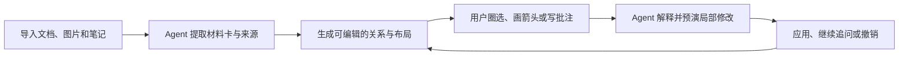
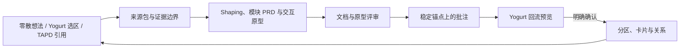

# Yogurt AI

<p align="center">
  
</p>

<p align="center"><strong>把文档、知识、图片和手绘批注，变成一个可持续生长、可圈选修改、可解释与可撤销的非线性思考画布。</strong></p>

<p align="center">
  <a href="README.en.md">English</a> ·
  <a href="#画布原生框线图">画布框线图</a> ·
  <a href="#product-bridge">Product Bridge</a> ·
  <a href="#安装">安装</a> ·
  <a href="#三分钟上手">三分钟上手</a> ·
  <a href="#开源参考与致谢">许可与参考</a>
</p>

Yogurt AI 基于开源项目 Cowart 和 tldraw，把用户提供的文档、知识、图片与画布批注组织为可编辑的材料卡、观点、证据、问题和关系。Agent 不会直接重写整张画布：复杂修改会先预演，再以原子操作写入相关区域，并保留解释与安全撤销能力。

<p align="center">
  
</p>
<p align="center"><sub>真实产品截图：把零散材料整理成可以继续拖拽、连线、补充和追问的结构图。演示画布使用完全虚构的公开示例数据，不包含任何用户材料。</sub></p>

## 它适合做什么

| 场景 | 你提供 | Yogurt AI 输出 |
| --- | --- | --- |
| 文档全景梳理 | PRD、研究资料、笔记、图片 | 带来源的材料卡、观点、证据、问题和关系图 |
| 非线性思考 | 一个主题或尚未理清的想法 | 可持续扩展的分支、聚类、对比和推理路径 |
| 圈选局部修改 | 圈线、箭头、划掉、分组、文字批注与自然语言要求 | 只作用于相关区域的修改、解释和 operation ID |
| 产品方案落地 | 零散想法、Yogurt 选区、可访问的需求材料与 TAPD 链接 | 可追溯 PRD、交互原型、评审画布分区和回流预览 |
| 画布框线图 | 选区、整页笔记、产品流程或系统关系 | 原生可编辑卡片图，或可访问、可追踪的安全内联 SVG |
| 视觉内容生成 | Prompt、参考图和画布上下文 | 可预览的 AI 图片、单文件 HTML 和 Slides |
| 画布整合导出 | 当前页面的全部可见对象 | 独立 HTML 全景或可继续编辑的 PowerPoint |

> Yogurt AI 的核心不是“一次生成整张图”，而是让材料、推理和视觉内容在同一个可编辑工作区里逐步长出来。

## 工作方式



## Excalidraw 风格工作区

工具栏、颜色、描边、字体、快捷键和手绘视觉语言参考 Excalidraw；`Yogurt AI` 菜单提供图片、HTML、Slides、交互 PRD 和独立的 `生成画布框线图` 入口。

<p align="center">
  
</p>
<p align="center"><sub>真实产品截图：同一份可编辑演示画布中打开 Yogurt AI 菜单。</sub></p>

## 画布原生框线图

`生成画布框线图` 是 Yogurt AI 的一级画布能力，与 Product Bridge 并行，互不自动触发。选中一组材料卡或直接使用整页后，Agent 会先提炼一个 teaching claim、对象、关系、状态与阅读顺序，再把结果直接画在当前 Yogurt 页面旁边；不会创建 PRD 工作区，也不会把图塞进 `interaction-prd.json`。

默认产物是真正的 Yogurt 原生对象：卡片、语义分区和绑定连线都可单独选择、移动、改字和继续连接。布局引擎支持横向、纵向、反向、center-out 与 board-to-peers 阅读顺序，循环关系会先做 SCC 分层；主路径、备选路径、双向同步、无向关联和包含关系分别映射为稳定的线型、箭头、lane 与 frame parentage。每个对象与关系都保留 `diagramId`、`semanticId`、来源 shape IDs、origin 和 state，便于后续继续整理或回读。

只有用户明确要求 SVG，或精确多端口、密集避障、细粒度泳道、GUI/LUI 线框无法用原生对象无歧义表达时，才会在当前画布插入一个安全的 HTML + inline SVG 图块。它仍是 Yogurt 画布对象，不属于 PRD 交互工作区。

```text
选中这些材料，生成一个从左到右的画布框线图。
核心判断是：创作者约束和安全闸门共同控制 AI 导演，
玩家行动只在可追踪状态内推动下一幕。
默认使用可编辑的原生节点、分区和关系线。
```


[查看独立画布案例、语义规格与可复用 Prompt](examples/semantic-diagram/ai-interactive-film-system/)。若使用 SVG 精确路线，可额外运行：

```powershell
node skills/cowart-semantic-diagram/scripts/validate-semantic-svg.mjs --root <artifact-root> <diagram.html>
```

## Product Bridge

Product Bridge 把 Yogurt AI 作为“想法整理面”，把 PRD 与交互原型工作区作为“产品评审面”。你不需要先把信息整理成完整需求文档：当前对话中的文字、Yogurt 选区或整页内容、产品假设，以及可访问的 TAPD 正文都可以成为输入。两边通过稳定来源 ID、需求 ID、页面 ID、标注锚点和画布分区保持可追溯。



### 从 Yogurt 生成 PRD 与交互原型

1. 在画布中选中要处理的产品区域；没有选区时会使用当前整页。单次范围最多 250 个对象，超过时会要求缩小选区，不会静默截断。
2. 打开右上角 `Yogurt AI`，选择 `生成交互 PRD`。Yogurt 会冻结点击瞬间的对象范围并把任务发送给 Codex。直接发送需要 Codex 原生 widget；独立 Vite 预览会保存范围并复制同一份指令。
3. Agent 会先建立来源包，区分用户原话、事实、产品假设、模型推断、约束和待确认问题，再生成 shaping 文档、带稳定 Requirement ID 的模块 PRD 和自包含交互 HTML 原型。
4. 原型中的重点控件绑定唯一 `data-annotation-anchor`。评审时的标注会跟随真实界面元素，而不是依赖容易漂移的截图像素坐标。
5. 工作区通过严格校验后，Agent 会交付本地评审地址、来源覆盖情况、未确认事项和可回流 Yogurt 的变更预览。

可以先在对话中补充一段自然语言需求，再点击 `生成交互 PRD`：

```text
我在做一个 AI 互动影游。玩家在电影化场景中做选择或输入自由行动，
AI 根据世界规则、角色关系和历史状态续写下一幕；创作者需要配置剧情、
规则、兜底分支和发布检查。

请结合当前 Yogurt AI 选区、上面的想法和我提供的 TAPD 链接：
1. 先区分已确认信息、假设和待确认问题；
2. 生成产品 shaping、模块 PRD 和可交互原型；
3. 保留来源到需求、页面、标注和画布分区的 trace map；
4. 完成后只给出回流 Yogurt AI 的预览，等我确认后再写回。
```

> 插件本身不内置 TAPD 登录或正文读取连接器。TAPD URL 本身也不是需求证据：只有用户环境中另行授权的连接器确实返回正文后，Yogurt AI 才会把它标记为已读取；缺少登录态或权限时会保留链接并标记为待解析，不会根据 URL 猜测内容。

### 从评审工作区回流 Yogurt

回流遵循 `读取最新 revision → dryRun 预演 → 展示精确变更 → 用户明确确认 → 对同一 revision 应用同一批操作`。返回内容使用真正的 Yogurt 分区、分区内卡片和关系；已有用户内容与无关区域不会被整页覆盖。如果确认前画布发生变化，旧预览会失效，Agent 必须重新计算并再次确认。每次成功回流都会返回 operation ID，供安全撤销。

### 案例：分岔回声｜AI 互动影游

[完整案例、PRD、可交互原型、Bridge 映射与运行说明](examples/product-bridge/ai-interactive-film-case/)已发布在仓库中。案例只从一句用户目标出发，没有读取 TAPD，因此故事设定、目标用户、指标和商业判断都被明确标记为 AI 假设，而不是产品事实。Product Bridge 与上面的画布框线图案例使用同一份来源，但作为两条独立流程运行。Product Bridge 最终生成：

| 产物 | 结果 |
| --- | --- |
| 产品 shaping | Brief、EARS 风格需求、玩家/创作者流程、模块计划 |
| 模块 PRD | AI 叙事引擎、玩家体验、创作者工作室 |
| 交互原型 | 作品发现、互动播放、可解释结局、故事编排、发布检查 5 个页面 |
| 页面关系 | 5 个真实原型页面及其可执行跳转，不包含语义图页面 |
| 评审定位 | 5 个评审页面、14 个稳定标注锚点，浏览器实测最大漂移 0.01px |
| Yogurt 回流 | 6 个产品分区、26 张分区内卡片、12 条关系；语义图不进入 Product Bridge trace map |


这个案例验证的是闭环，而不是某一版故事创意：Yogurt 中的模糊想法可以被整理成可评审产品文档，评审结论也可以沿同一条 trace map 返回原始思考画布。

### 手动校验生成的工作区

从插件仓库根目录运行以下命令；`<workspace>` 指生成的 Product Bridge 工作区，不是插件目录：

```powershell
python -B -X utf8 skills/cowart-product-bridge/scripts/validate_workspace.py <workspace> --strict
python -B -X utf8 skills/cowart-product-bridge/scripts/serve.py <workspace>
```

两条命令分别执行严格结构校验和本地评审预览。

## 安装

### 从公开 Fork 安装

> 产品对外名称已改为 Yogurt AI。为兼容现有安装和画布数据，GitHub 仓库、插件 ID、MCP 工具名与 `COWART_*` 环境变量暂时保留原技术标识。

```bash
git clone https://github.com/suud003/Cowart.git
cd Cowart
npm install
npm run build
codex plugin marketplace add <Cowart-绝对路径>
codex plugin add cowart-thinking-canvas@cowart-thinking-github
```

安装或重新安装后，请开启一个新的 Codex 任务，让 Skill 和 MCP 工具完整加载。

### 让 Codex 自动安装

把下面这段发给 Codex：

```text
请从我提供的 Yogurt AI 解压目录安装本地 Codex 插件。
先在插件根目录运行 npm install 和 npm run build，再运行
codex plugin marketplace add <解压后的-cowart-thinking-canvas-绝对路径>，
再运行 codex plugin add cowart-thinking-canvas@cowart-thinking-github，
并用 codex plugin list 确认插件已启用。安装完成后提醒我开启一个新任务，
以便加载新的 Skill 和 MCP 工具。
```

### 手动安装

先在解压后的插件根目录安装依赖，再把该目录注册为 Codex marketplace：

```bash
npm install
npm run build
codex plugin marketplace add <absolute-path-to-cowart-thinking-canvas>
```

再从这个 marketplace 安装并检查插件：

```bash
codex plugin add cowart-thinking-canvas@cowart-thinking-github
codex plugin list
```

如果 `cowart-thinking-github` 已经指向当前解压目录，可以跳过第一条命令。安装或重新安装后请开启一个新的 Codex 任务，让 Skill 和 MCP 工具完整加载。

## 三分钟上手

### 1. 打开画布

安装插件并开启一个新的 Codex 任务后，直接说：

```text
打开这个项目的 Yogurt AI 画布。
```

Yogurt AI 会通过兼容工具 `render_cowart_canvas_widget` 打开原生画布，不需要手动启动网页服务。画布数据保存在当前项目的 `canvas/pages/<page-id>/`，不会写入插件仓库。

### 2. 把材料交给 Agent

把文档、图片或笔记放进当前项目，然后说：

```text
把 docs/research 目录里的材料导入 Yogurt AI。
保留文件路径和原文摘录，把“来源内容”和“你的推断”明确区分开。
```

Agent 会把材料变成带来源信息的卡片。项目外部文件只有在你明确允许时，才会复制到 `canvas/materials/`。

### 3. 让结构长出来

```text
围绕“用户为什么会放弃这个流程”整理一张全景图：
先列证据和问题，再补充假设与洞察；用关系线表达因果、支持和冲突。
不要改写原始材料卡。
```

复杂操作会先针对当前 revision 预演；确认画布没有被其他操作改动后，再原子应用同一批卡片、关系与布局修改。

### 4. 圈选并继续修改

点击顶部的 `AI 圈选`，手绘一个闭合区域。Yogurt AI 会选中圈内对象，并把圈线、箭头、划掉、分组、文字批注和选区截图一起交给 Agent。

<p align="center">
  
</p>
<p align="center"><sub>真实产品截图：圈选以后可以直接说“合并圈内内容”“按批注重排”“解释这部分逻辑”或“只修改圈内内容”。</sub></p>

```text
把我圈出的两张卡合并成一个结论卡，保留两条来源；
重新整理圈内关系，但不要移动圈外内容。完成后解释你的修改。
```

Agent 会返回它对批注的理解、修改结果和可撤销的 operation ID。独立 Vite 预览只能保留选区并复制指令；要直接触发 Agent，请使用 Codex 原生 Yogurt AI widget。

### 生成新图

1. 打开 Yogurt AI 画布。
2. 在画布里创建并选中一个 `AI 图片` 框。
3. 在弹出的生成面板里输入 prompt，也可以选择一张或多张参考图，然后点击发送。

Yogurt AI 会把 prompt、参考图和选中 `AI 图片` 框的尺寸信息发送给 Codex。Codex 会按这个框的位置和比例生成图片，然后把 `AI 图片` 框替换成普通图片形状。

下面的原创示例以“怎么让游戏变得更好玩”为主题，先生成一张路线较单一的双人合作天空遗迹关卡，作为后续圈注迭代的原图。


### 根据标注图生成新图

1. 在 Yogurt AI 画布中对图片做标注。
2. 选中被标注的图片，点击 `按标注修改`。
3. Yogurt AI 会导出包含原图、箭头和标注文字的截图，并通过 widget bridge 发送给 Codex。

Codex 会读取截图里的标注和箭头，生成去掉标注痕迹的新图，并把结果放在原图旁边。原图和标注不会被删除或移动。你也可以手动把 Yogurt AI 标注截图发给 Codex，走同样的修订流程。

示例圈出了风险捷径、双人协作机关、隐藏奖励和出口反馈；右侧是 Yogurt AI 根据这些标注生成的干净新版本。


### 生成 AI HTML

1. 在工具栏中创建并选中一个 `AI HTML` 框；新建框默认是 `1024 × 576`（16:9）。
2. 在框下方的生成面板中输入 prompt，也可以选择或粘贴一张或多张参考图。
3. 点击发送后，Codex 会生成完整可运行的单文件 HTML，并把它嵌入选中的 `AI HTML` 框。

生成后的 HTML 会作为画布中的嵌入页面保存在当前 page 的 `assets/` 目录。选中它后可以下载渲染图、直接编辑文本，也可以结合画布标注继续修改 HTML，或根据 HTML 和标注生成图片。

示例生成了一个可编辑的“游戏乐趣诊断台”，把选择、挑战、反馈、成长和下一轮实验放在同一个可视化工作区中。


### 创建和演示 AI Slides

1. 在工具栏中创建一个 `AI Slides`。默认外框是 `1048 × 600`，对应一页 `1024 × 576`（16:9）内容和四周各 `12px` 的留白。
2. 可以把画布中的图片或 HTML 拖入 Slides，也可以复制图片后选中 Slides，再粘贴进去；内容会自动按顺序横向排列。
3. 空 Slides 被选中时会显示生成面板。输入整套演示的描述、按需添加参考图，并选择 3、5、10 页或自定义页数；默认是 5 页。
4. 发送后，Codex 会生成指定数量、视觉与叙事连贯的独立 16:9 HTML 页面，并依次加入当前 Slides。Slides 已有内容时不再显示生成面板。
5. 选中 Slides 后点击 `演示 Slides`，可以通过左侧缩略图预览和切换页面，也可以进入全屏播放。全屏时支持方向键、空格键和点击静态画面翻页；HTML 自身的按钮、链接和表单交互会保留，播放控制栏固定在顶部。

示例把“挑战 × 选择 × 反馈”整理成三页原创游戏设计提案，并在 Yogurt AI 的真实演示器中预览和切换。


### 整合当前画布为 HTML 或 PowerPoint

1. 点击右上角 `Yogurt AI`，选择 `整合为 HTML` 或 `整合为 PowerPoint`。
2. Yogurt AI 会读取当前 page 的全部可见对象，并把 HTML 嵌入、图片、卡片、文字、连线与手绘标注合成完整全景。
3. HTML 是一个不依赖服务器的单文件，支持拖拽、缩放、适应窗口和从内容目录定位；PPTX 包含全景页、目录页和内容详情页。

PPTX 中的标题、目录和详情文字是 PowerPoint 原生文本，可以继续修改；图片、HTML 和复杂手绘内容会以独立视觉对象保真，可在 PowerPoint 中移动、缩放或替换。文件会保存到系统下载目录。

下面使用公开构造的“怎么让游戏变得更好玩”画布展示真实操作。打开 `Yogurt AI` 后，可以直接选择全景 HTML 或 PowerPoint：


HTML 会把当前页面整合为带内容目录的独立全景文件：


PowerPoint 会生成全景、目录和详情页；下图中的目录文字框是被实际选中的原生 PowerPoint 文本，可以继续编辑：


## 数据、来源与撤销

- 画布页面保存在 `canvas/pages/<page-id>/cowart-canvas.json`，图片与 HTML 保存在同一页面的 `assets/` 目录。
- Product Bridge 工作区保存在用户选择的项目目录，包含来源包、PRD、原型、产品分区映射、trace map 和同步状态；画布框线图保留在 Yogurt 画布及独立案例目录，不进入 Product Bridge 工作区。
- 材料卡分别保存来源路径、原文摘录和 Agent 摘要，避免把事实与推断混在一起。
- TAPD 等外部链接会记录实际访问状态；未授权或未读取的链接不会被当作已确认需求。
- 非简单修改遵循“读取上下文 → `dryRun` 预演 → revision 校验 → 原子应用”的流程。
- 每批 Agent 修改都会返回 operation ID；只要后续画布状态兼容，就可以安全撤销，而不会覆盖更新的用户操作。

## 技能

- `cowart-thinking-canvas:cowart-product-bridge`：把零散想法、Yogurt 选区和 TAPD 引用整理成可追溯 PRD、交互原型与评审画布，并在明确确认后安全回流 Yogurt。
- `cowart-thinking-canvas:cowart-semantic-diagram`：默认直接在当前画布生成原生可编辑分区、卡片和绑定关系；只有显式要求或精确拓扑无法原生表达时才使用安全内联 SVG。
- `cowart-thinking-canvas:cowart-thinking-agent`：依据材料和批注执行“检查上下文 → 区分来源与推断 → 预演 → 局部应用 → 解释与撤销”的工作流。
- `cowart-thinking-canvas:cowart-open-canvas`：打开 Yogurt AI 原生画布 widget。
- `cowart-thinking-canvas:cowart-image-gen`：接收画布内 prompt 和参考图，用生成图片替换选中的 `AI 图片` 框；没有选中框时也可以把生成图插入当前页面。
- `cowart-thinking-canvas:cowart-image-edit`：根据画布提交或用户提供的 Yogurt AI 标注截图生成修订图。

## 本地开发

```bash
npm install
npm run dev
npm run build
```

本地开发时仍可以直接启动 Vite 画布服务，并指定用户项目目录：

```bash
./scripts/start-canvas.sh /path/to/user/project
```

Vite 页面只用于界面开发，不包含 Codex 的 Agent 消息桥。AI 圈选在本地预览中会保留选区并复制指令，同时给出明确提示；要让指令直接触发 Agent，请使用 `render_cowart_canvas_widget` 打开的原生 Yogurt AI 画布。

常用环境变量：

- `COWART_PORT`：本地服务端口，默认 `43217`。
- `COWART_PROJECT_DIR`：画布数据所属的用户项目目录。
- `COWART_CANVAS_DIR`：画布数据目录，默认是 `$COWART_PROJECT_DIR/canvas`。

## 开发者

ZHONG XIN  
zhongxin123456@gmail.com  
https://www.jiqiren.ai

## 开源、参考与致谢

本仓库是 [zhongerxin/Cowart](https://github.com/zhongerxin/Cowart) 的公开 Fork，保留 GitHub Fork 关系和原项目 MIT 许可证。当前发布版本由 [`suud003/Cowart`](https://github.com/suud003/Cowart) 维护。

- [tldraw/tldraw](https://github.com/tldraw/tldraw)：Yogurt AI 的无限画布、图形编辑和交互运行时。当前锁定版本为 `5.1.1`，适用 tldraw 自有许可证，不是 MIT。默认许可仅允许开发环境使用；公开生产部署需要符合其试用、商业或其他替代许可。完整许可证见 [`licenses/TLDRAW-LICENSE.md`](licenses/TLDRAW-LICENSE.md)。
- [excalidraw/excalidraw](https://github.com/excalidraw/excalidraw)：工具布局、手绘视觉语言和交互细节的设计参考。项目没有把 Excalidraw 编辑器作为运行依赖；打包的 Excalifont 文件与霞鹜小赖字形子集清单来自官方 `@excalidraw/excalidraw@0.18.1` 发布包，霞鹜小赖字体文件在运行时从该固定版本的公共 CDN 加载。
- [Excalifont](https://github.com/excalidraw/excalidraw/tree/master/packages/excalidraw/fonts)、[霞鹜小赖](https://github.com/lxgw/kose-font) 与 Assistant：字体文件按 SIL Open Font License 1.1 分发，具体版权信息和完整 OFL 文本见 [`src/assets/fonts/FONT-LICENSES.md`](src/assets/fonts/FONT-LICENSES.md) 与 [`src/assets/fonts/OFL-1.1.txt`](src/assets/fonts/OFL-1.1.txt)。
- [PptxGenJS](https://github.com/gitbrent/PptxGenJS)：在浏览器中生成标准 OOXML `.pptx` 文件，用于画布整合导出；按 MIT License 分发。

根目录 `LICENSE` 只覆盖 Cowart 上游代码与本 Fork 的 MIT 授权部分，不会覆盖或替代第三方依赖的许可证。完整说明见 [`THIRD_PARTY_NOTICES.md`](THIRD_PARTY_NOTICES.md)。
