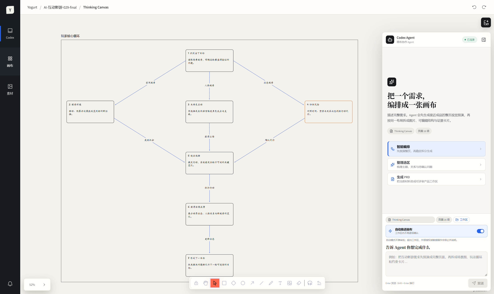
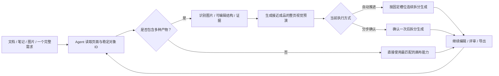
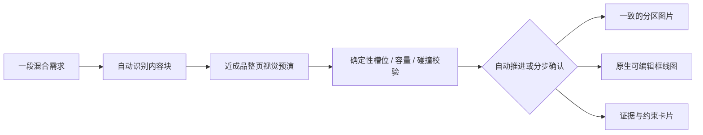

# Yogurt AI

<p align="center">
  
</p>

<p align="center"><strong>在画布里想清楚，交给 Codex Agent 做出来，再把结果带回画布继续迭代。</strong></p>

<p align="center"><strong>Yogurt AI Desktop · Beta</strong> · 本地优先 · 可编辑画布 · Codex Agent 桥接</p>

<p align="center">
  <a href="README.en.md">English</a> ·
  <a href="#windows-桌面应用beta">Windows 下载</a> ·
  <a href="#一条完整的产品工作流">产品体验</a> ·
  <a href="#核心体验">核心体验</a> ·
  <a href="#完整案例ai-互动影游">完整案例</a> ·
  <a href="#三分钟上手">快速开始</a>
</p>

Yogurt AI 是一个可安装的 AI 产品工作台，同时提供独立桌面应用和 Codex 插件。它把 tldraw 原生无限画布与 Codex Agent 放进同一个界面：你可以整理本地文档、笔记、图片、对话和直接粘贴的需求摘录，也可以只描述一次完整需求，让 Agent 自动判断哪些内容应该生成图片、哪些应该成为原生可编辑结构、哪些必须保留为证据与约束。

对于同时包含画面、流程和约束的需求，Agent 会先生成一张接近成品的整页视觉预演：场景图、流程节点、关系连线、证据卡片、标题层级和留白都会在一张完整页面中大致成形。随后它按同一套分区分别生成视觉素材，并把流程与约束重建为原生可编辑对象。原生框线图由融合 `html-line-svg` 方法的确定性布局引擎排布，写入前会检查槽位容量、节点碰撞、文字边界、关系端口和越界，无法安全容纳时直接要求拆分，而不是写入一团重叠内容。若视觉服务暂时不可用，图片槽会保留为可重试状态，原生框线图和证据卡仍会继续生成。开启“自动推进画布”后，工作区内的可逆步骤会连续完成，不再逐次弹出审批。

<p align="center">
  
</p>
<p align="center"><sub>真实桌面渲染：同一页里查看可编辑关系图、Agent 入口和自动推进状态；内部执行模板不会混进用户对话。</sub></p>

## Windows 桌面应用（Beta）

普通用户不需要安装 Node.js、Git 或全局 Codex CLI。使用 Windows x64 安装包即可开始：

1. 从 [GitHub Releases 下载 Yogurt AI Beta 0.2.12](https://github.com/suud003/Cowart/releases/tag/v0.2.12%2Bcodex.20260829) 的 `Yogurt-AI-Beta-Setup-0.2.12-x64.exe`。
2. 双击安装包，按向导完成安装。安装程序会创建桌面和开始菜单快捷方式。
3. 第一次打开 Yogurt AI 时，选择一个产品文件夹作为工作区。画布、生成文件和项目会话都会保存在这里；取消选择也不会导致应用崩溃，可以稍后从 Agent 面板重新选择。
4. 进入画布后，右下角 Codex 入口会使用应用内置、经过兼容性验证的 Codex 与 Node 运行时自动连接，并复用当前电脑已有的 Codex 登录状态。若尚未登录，展开工作台并点击“登录 Codex”：Yogurt AI 会打开官方浏览器授权页，并在成功后自动连接，无需运行终端命令。

当前 Beta 安装包尚未进行代码签名，Windows SmartScreen 可能显示“Windows 已保护你的电脑”。请只从本仓库的 GitHub Releases 下载，并核对 Release 页面公布的 SHA-256。

## 一条完整的产品工作流



| 从哪里开始 | Codex Agent 如何参与 | 最终留下什么 |
| --- | --- | --- |
| 零散研究、会议记录与需求链接 | 按来源整理事实、观察、假设和待确认问题 | 可继续聚类、连线和追问的知识全景 |
| 同时包含场景、玩法流程和产品约束的一段需求 | 先生成近成品整页预演并校验分区；再按同一槽位生成视觉部件、原生结构与证据 | 版面完整、不会互相挤压、语义可编辑且来源可追溯的一张产品画布 |
| 一组画布卡片或一个待解释系统 | 读取当前页与精确选区，规划并生成语义结构 | 原生可编辑的卡片、分区和绑定连线 |
| 一个还不完整的产品想法 | 补齐约束与验收标准，生成 PRD 和可交互页面 | 可评审、可标注、可回流的产品工作区 |
| 已完成的整张画布 | 汇总卡片、图片、HTML、Slides 与手绘内容 | 可分享 HTML 全景或可编辑 PowerPoint |

## 核心体验

### 1. 画布与 Codex Agent 共用同一份上下文

Codex 入口固定在桌面应用右下角；需要时展开为覆盖式工作台，不会压缩或打乱当前画布。它知道当前项目、页面、选中对象和它们的稳定 ID；发送任务前会先保存最新画布，因此 Agent 处理的是你眼前的真实内容，而不是一张容易错位的截图。

你可以直接输入要求，也可以从 `智能编排`、`整理选区`、`生成 PRD` 开始；需要框线图时，直接用自然语言让 Agent 在当前画布生成可编辑结构。快捷入口在会话中只显示任务意图和你的补充文字，内部执行模板作为隐藏上下文传递，不会冒充用户消息。工作台会完整保留回复、计划、修改摘要和任务状态；应用在后台时，系统通知和任务栏提醒会提示新回复与待处理操作。短时连接波动会在原任务内显示为恢复进度，不会提前误报失败或重复执行。分步模式仍可处理必要确认；自动模式在现有工作区权限内连续执行，遇到外部授权、越权写入、凭据、付费或删除用户内容等受保护动作时会停止该动作并说明边界，不把它变成新的阻塞弹窗。同一版本再次打开项目时会继续已保存的 Agent 会话；应用升级后会建立干净的新会话，同时保留项目画布和文件。

把文档、图片和笔记导入画布后，Yogurt AI 会保留来源路径与原文摘录，并把 Agent 的总结和推断分开记录。你可以像使用白板一样组织卡片、关系、分区和手绘标注，也可以让 Agent 围绕一个问题自动搭建全景结构。

当你只想修改局部时，使用 `AI 圈选` 圈住相关对象，再用箭头、划掉、分组或文字说明意图。Agent 会结合选区内容和标注完成局部调整，圈外内容保持不动。

<table>
  <tr>
    <td width="50%"><br><strong>让材料长成结构</strong>：从来源、观察和问题出发，形成假设与下一步实验。</td>
    <td width="50%"><br><strong>只改需要推进的部分</strong>：圈选对象并添加批注，圈外内容保持不动。</td>
  </tr>
</table>

### 2. 一次描述，自动编排图片与可编辑结构

在 Agent 工作台点击 `智能编排`，或直接输入一段同时包含场景、角色、流程、关系和约束的需求。Yogurt AI 会先把需求拆成 `视觉图片`、`原生可编辑框线图`、`证据与约束卡片` 三类，并给每个内容块保留来源与稳定 ID。

第一阶段会先建立带内容规格的结构化页面计划，再输出一张接近成品的整页视觉预演。它不只是画几个占位框：图片区已有代表性场景，流程区已有可辨认的节点、分支与连线，证据区已有真实的标题层级和内容密度。生成前，Yogurt AI 会确定性检查槽位是否越界、重叠、间距不足或内容过密。

第二阶段严格沿用同一组槽位：视觉内容把对应预演区域作为构图和风格参考；玩法循环和系统关系依据原始材料重建为原生可编辑对象；约束与来源重建为可追溯卡片。写入前还会检查真实节点、文字和连线边界，发现拥挤会先重新排布，而不是把重叠结果写进画布。预演图片只负责视觉和构图，不能替代产品语义。若整页预演在两次尝试后仍不可用，Yogurt AI 会只暂停视觉槽并继续完成可编辑结构与证据卡，不再让一次图片错误中断整张画布。

默认使用“分步确认”，整页预演完成后暂停一次。开启“自动推进画布”后，当前工作区内的可逆画布步骤会在同一任务里连续完成，审批请求由 Codex 自动审查，不再逐次打断用户。超出工作区、外部授权、凭据、付费和破坏性操作不会被静默放行，而是保持未执行并在结果中说明。



### 3. 把复杂关系画成可编辑框线图

框线图是 Yogurt AI 画布的原生能力。选择一组材料，直接用自然语言让 Agent 在当前画布生成框线图；Yogurt AI 会先找出这张图最应该表达的核心判断，再组织对象、状态、关系和阅读顺序。默认结果由原生卡片、语义分区和绑定连线组成，每个元素都能单独选择、移动、改字和继续连接。

布局引擎把 `html-line-svg` 的教学语义和几何规则真正落进原生画布：先确定阅读方向与层级，再根据文字估算卡片尺寸，在固定分区内居中分布；分叉与汇合使用不同边界端口，长关系绕开无关节点，主路径、备选路径、双向同步、无向关联与包含关系保持不同语法。预演和正式写入会返回同一个布局摘要；任何节点碰撞、文字越界或槽位容量不足都会阻止提交。


[查看画布框线图案例、可复用 Prompt 与语义规格](examples/semantic-diagram/ai-interactive-film-system/)

### 4. 从零散想法生成 PRD 与交互原型

选中产品相关的画布区域，点击 `生成 PRD`。Yogurt AI 会结合当前对话、选区或整页内容、产品假设、用户直接提供的需求摘录和项目文档，生成可追溯的 shaping 文档、模块 PRD 和自包含交互原型。

评审不再依赖容易漂移的截图坐标：标注会锚定在真实界面元素上，你可以一边操作原型，一边对照 PRD 留下意见。评审完成后，Yogurt AI 会先展示回流预览；确认后，再把结论写回原始画布中的产品分区、卡片和关系。


[查看完整 Product Bridge 案例、PRD、原型与运行说明](examples/product-bridge/ai-interactive-film-case/)

### 5. 创作内容，并把整张画布带走

Yogurt AI 的创作与交付工具都在同一个菜单中：

| 能力 | 适合的任务 | 结果 |
| --- | --- | --- |
| AI 图片 | 从 prompt 和参考图生成视觉稿；根据画布标注修图 | 新图片放回指定位置，原图与标注保留 |
| AI HTML | 生成可运行的数据看板、解释页或交互内容 | 单文件 HTML 嵌入画布，可继续编辑与下载 |
| AI Slides | 从主题和参考素材生成连贯演示 | 可在 Yogurt AI 中预览、切页和全屏播放 |
| 整合导出 | 汇总当前页面的卡片、连线、图片、HTML 与手绘内容 | 可缩放全景 HTML，或可继续编辑的 PowerPoint |

<table>
  <tr>
    <td width="50%"><br><strong>AI 图片</strong>：结合 prompt、参考图和画布位置生成视觉稿。</td>
    <td width="50%"><br><strong>按标注修改图片</strong>：保留原始素材，在旁边生成干净修订版。</td>
  </tr>
  <tr>
    <td width="50%"><br><strong>AI HTML</strong>：把想法直接做成可运行、可继续编辑的交互内容。</td>
    <td width="50%"><br><strong>AI Slides</strong>：生成连贯页面，并在画布中直接演示。</td>
  </tr>
  <tr>
    <td width="50%"><br><strong>HTML 全景</strong>：把当前画布整合成带目录的独立文件。</td>
    <td width="50%"><br><strong>PowerPoint 导出</strong>：保留全景、目录和可编辑的原生文字。</td>
  </tr>
</table>

## 完整案例：AI 互动影游

“分岔回声”展示了一条完整的产品旅程：从一句“让玩家用选择或自然语言推动电影剧情”的想法出发，先在 Yogurt AI 中梳理创作者约束、玩家行动、AI 导演、安全闸门和状态账本，再生成产品文档与五个可交互页面，最后在真实原型上完成标注与回流。

| 阶段 | 案例产物 |
| --- | --- |
| 梳理系统 | 一张原生可编辑的 AI 互动影游系统框线图 |
| 定义产品 | shaping、AI 叙事引擎、玩家体验和创作者工作室 PRD |
| 验证体验 | 作品发现、互动播放、可解释结局、故事编排、发布检查 5 个页面 |
| 评审方案 | 原型与 PRD 同屏，14 个稳定标注锚点，页面关系可视化 |
| 回到思考 | 将确认后的结论整理回 Yogurt 产品分区，继续迭代 |

<table>
  <tr>
    <td width="50%"><br><strong>从产品结构看到完整页面链路</strong></td>
    <td width="50%"><br><strong>再把体验做成可交互页面</strong></td>
  </tr>
</table>

[浏览完整产品案例](examples/product-bridge/ai-interactive-film-case/) · [浏览画布框线图案例](examples/semantic-diagram/ai-interactive-film-system/)

## 开发者与高级用法

安装包已经包含桌面运行所需的固定 Codex 与 Node 运行时。以下源码方式仅面向开发、调试或自定义集成，不是普通用户的安装步骤。

<details>
<summary><strong>从源码启动</strong></summary>

```bash
git clone https://github.com/suud003/Cowart.git
cd Cowart
npm install
npm run desktop
```

源码启动会先构建前端，再打开 Electron。首次启动仍会使用系统目录选择器；也可以显式指定开发工作区：

```powershell
$env:YOGURT_WORKSPACE_ROOT = 'D:\path\to\your-product'
npm run desktop
```

只有在调试外部 Codex CLI 时才需要全局安装或入口覆盖：

```powershell
npm install -g @openai/codex
codex login
$env:YOGURT_CODEX_JS = "$env:APPDATA\npm\node_modules\@openai\codex\bin\codex.js"
```

桌面应用还可与仓库内的 Codex 插件能力一起开发和验证：

```bash
npm run build
codex plugin marketplace add .
codex plugin add cowart-thinking-canvas@cowart-thinking-github
codex plugin list
```

实现、环境变量和故障排查见 [`desktop/README.md`](desktop/README.md)。

</details>

## 三分钟上手

### 1. 选择一个真实项目

从桌面快捷方式打开 Yogurt AI，在首次启动窗口中选择产品文件夹。应用会在该工作区读取和保存画布，并通过右下角入口自动连接本地 Codex Agent；首次需要授权时，展开工作台，点击“登录 Codex”并在浏览器完成登录即可。

### 2. 放入材料，形成第一版结构

把文档、图片或笔记放进当前项目，再从 Agent 工作台发送：

```text
把 docs/research 里的材料整理到 Yogurt AI。
保留来源和关键原文，先区分证据、假设和待确认问题，
再围绕“用户为什么会放弃这个流程”生成一张可编辑全景图。
```

### 3. 圈选对象，把下一步交给 Agent

圈选需要推进的卡片，直接用自然语言描述目标：

- `把选区整理成一张说明核心判断的框线图。`
- `用智能编排处理这段互动影游需求：先生成接近成品的整页视觉预演，再按同一分区生成场景图、可编辑玩法循环和约束卡片。`
- `基于这些材料和需求摘录，生成可评审的 PRD 与交互原型。`
- `把评审中确认的结论写回原画布，并保留来源。`

### 4. 评审、回流与交付

在工作台查看 Agent 的计划和修改摘要；使用分步模式完成必要确认，或开启自动模式让工作区内的可逆步骤连续完成。随后继续拖拽或改写画布对象。成熟成果可以通过右上角 `Yogurt AI` 菜单整合为 HTML 或 PowerPoint，也可以继续生成 AI 图片、HTML 与 Slides。

## 数据、来源与安全

- 画布数据保存在当前项目的 `canvas/pages/<page-id>/`；页面图片与 HTML 保存在对应的 `assets/` 目录。
- 来源路径、原文摘录和 Agent 总结分开保存，便于判断哪些内容来自材料，哪些属于分析与推断。
- 外部链接只会作为来源地址保存，不会被自动当成已读取材料；需要引用其中的需求时，请直接粘贴正文或提供导出文件。
- 原生批量变更会先展示预览，并在 revision 校验通过后写入；应用保留受保护的撤销能力。图片生成与原生批量写入是可追踪的独立步骤。
- 精确 SVG 图块在写入画布前会经过结构与脚本安全校验。
- 项目外文件只有在用户明确允许时，才会复制到画布材料目录。
- 桌面应用通过本机 stdio 连接 Codex App Server；网页渲染层不能提交任意 RPC、Shell 命令、进程启动请求或白名单以外的 MCP 工具调用。
- Yogurt AI 不调用 `chatgpt.com/backend-api/...` 等 ChatGPT 内部接口。桌面 Agent 使用本机 stdio Codex App Server；未来若增加直接模型 API 集成，必须使用公开的 `https://api.openai.com/v1/responses` 并通过 API Key 鉴权。
- 分步模式会把需要用户决定的文件修改、命令和信息请求明确展示在工作台内。
- 自动模式使用 `never` 审批策略：工作区内的可逆操作直接继续；越权写入、外部授权、凭据、付费和删除用户内容等受保护操作会被拒绝并在结果中说明，不会以弹窗阻塞用户，也不会扩大 Codex 权限。

## 技术信息

<details>
<summary><strong>内置 Skills 与工作区校验</strong></summary>

- `cowart-thinking-canvas:cowart-thinking-agent`：整理来源、构建思考空间、预演和应用局部修改。
- `cowart-thinking-canvas:cowart-auto-compose`：先生成接近成品的整页视觉预演并验证槽位，再按同一页面计划生成图片、原生结构和证据卡片。
- `cowart-thinking-canvas:cowart-semantic-diagram`：在当前画布生成和修订可追溯框线图。
- `cowart-thinking-canvas:cowart-product-bridge`：把产品材料转换为 PRD 与交互原型，并处理评审回流。
- `cowart-thinking-canvas:cowart-image-gen` / `cowart-image-edit`：生成图片和执行标注驱动修订。
- `cowart-thinking-canvas:cowart-open-canvas`：打开当前项目的 Yogurt AI 原生画布。

校验生成的 Product Bridge 工作区：

```powershell
python -B -X utf8 skills/cowart-product-bridge/scripts/validate_workspace.py <workspace> --strict
python -B -X utf8 skills/cowart-product-bridge/scripts/serve.py <workspace>
```

校验精确 SVG 框线图：

```powershell
node skills/cowart-semantic-diagram/scripts/validate-semantic-svg.mjs --root <artifact-root> <diagram.html>
```

</details>

<details>
<summary><strong>本地开发</strong></summary>

```bash
npm install
npm run dev
npm run build
npm run desktop
```

也可以为指定用户项目启动 Vite 画布预览：

```bash
./scripts/start-canvas.sh /path/to/user/project
```

本地 Vite 页面只用于画布 UI 开发，不包含 Codex Agent 桥接；`npm run desktop` 才会启动带本地 Agent 工作台的完整桌面体验。也可以在 Codex 中安装 Yogurt AI 插件，使用原生 Widget 与相同的画布能力。

常用环境变量：

- `COWART_PORT`：本地服务端口，默认 `43217`。
- `COWART_PROJECT_DIR`：拥有画布数据的用户项目目录。
- `COWART_CANVAS_DIR`：画布数据目录，默认 `$COWART_PROJECT_DIR/canvas`。
- `YOGURT_WORKSPACE_ROOT`：桌面应用当前操作的产品项目目录。
- `YOGURT_CODEX_JS`：Windows 上需要显式指定时使用的 Codex CLI JavaScript 入口。
- `YOGURT_VITE_DEV_URL`：桌面端开发模式加载的本机 Vite 地址，仅接受 loopback HTTP URL。
- `VITE_TLDRAW_LICENSE_KEY`：构建时注入的合法 tldraw SDK license key；未配置时会按 tldraw 许可要求显示官方水印。

</details>

## 开发者

ZHONG XIN  
zhongxin123456@gmail.com  
https://www.jiqiren.ai

## 开源、许可与致谢

本仓库是 [zhongerxin/Cowart](https://github.com/zhongerxin/Cowart) 的公开 Fork，保留 GitHub Fork 关系和上游 MIT 许可；当前公开版本维护在 [`suud003/Cowart`](https://github.com/suud003/Cowart)。

- [tldraw/tldraw](https://github.com/tldraw/tldraw) 提供无限画布、形状编辑与交互运行时。项目固定使用 `5.1.1`；tldraw 使用其独立许可，公开或商业分发前必须取得适用授权并配置合法 license key。详见 [`licenses/TLDRAW-LICENSE.md`](licenses/TLDRAW-LICENSE.md)。
- [excalidraw/excalidraw](https://github.com/excalidraw/excalidraw) 是工具栏布局、手绘视觉语言与交互细节的设计参考，并非运行时依赖。
- Excalifont、Xiaolai 和 Assistant 字体使用 SIL Open Font License 1.1。详见 [`src/assets/fonts/FONT-LICENSES.md`](src/assets/fonts/FONT-LICENSES.md)。
- [PptxGenJS](https://github.com/gitbrent/PptxGenJS) 用于在浏览器中生成标准 `.pptx` 文件，采用 MIT 许可。

根目录 `LICENSE` 仅覆盖上游 Cowart 代码和本 Fork 中采用 MIT 许可的部分，不覆盖第三方组件。完整说明见 [`THIRD_PARTY_NOTICES.md`](THIRD_PARTY_NOTICES.md)。
