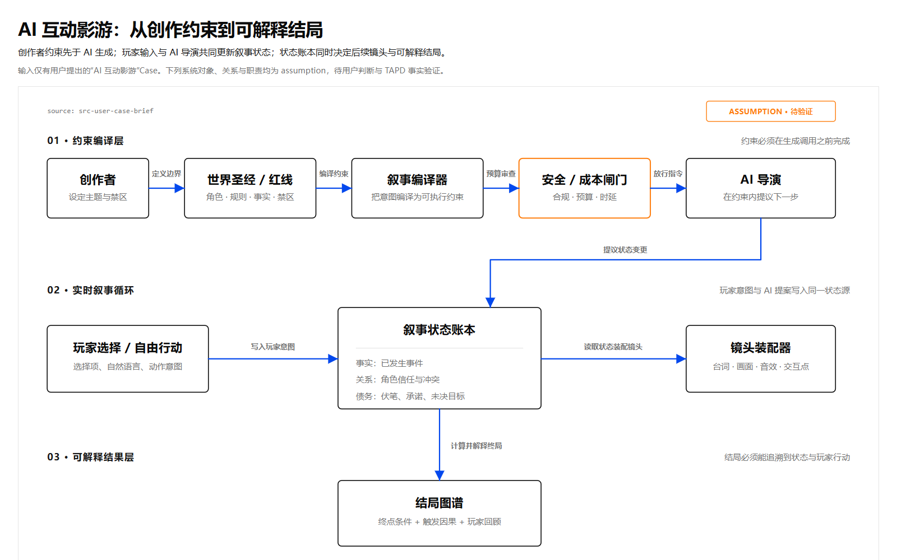
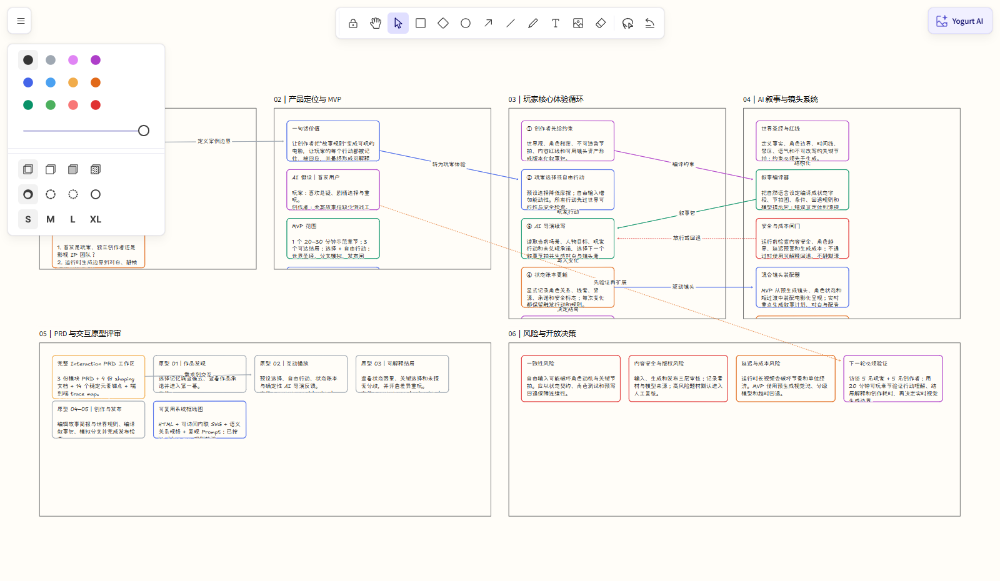

# 分岔回声｜AI 互动影游 Product Bridge 案例

这是一个从一句模糊产品想法出发，经过 `Yogurt AI → Product Bridge → PRD 与交互原型 → 语义画布 → 确认后回流 Yogurt` 的完整案例。

唯一用户输入是：把 PRD 生成、画图与布局能力融合进 Yogurt AI，并用“AI 互动影游”做一个 case。本案例没有读取 TAPD；故事设定、目标用户、指标和商业判断均为演示用 AI 假设，不代表已确认需求。

## 结果一览

| 维度 | 实际产物 |
| --- | --- |
| 产品结构 | 4 份 shaping 文档、3 份模块 PRD、1 份体验与视觉基线 |
| 评审工作区 | 3 个模块、6 个页面、14 个稳定标注锚点 |
| 交互原型 | 作品发现、互动播放、可解释结局、故事编排、发布检查 5 个页面 |
| 语义图 | 1 张可访问、响应式、安全内联 SVG 系统框线图 |
| Yogurt 回流 | 6 个分区、27 张分区内卡片、12 条关系，合计 45 个 typed operations |
| 验证结果 | Product Bridge 与 SVG 严格校验无错误；标注浏览器实测最大漂移 0.01px |

## 1. 全局画布：先看到完整产品，而不是一叠页面

Product Bridge 会把页面关系转成可缩放的全局画布。6 个页面按主流程自动排列，关系线区分主路径、备选路径和模块间依赖；页面卡片仍然是真实原型缩略图，不是重新画的一张静态示意图。


这个视图用于回答三个问题：产品有哪些模块、用户如何跨页面流动、哪一页的调整会影响其他页面。

## 2. Yogurt 新入口：选区直接生成 PRD 或语义框线图

在 Yogurt AI 菜单中可以直接选择 `生成交互 PRD` 或 `生成语义框线图`。有选区时冻结点击瞬间的精确对象；没有选区时使用当前整页。单次最多处理 250 个对象，超出会要求缩小范围，不会静默截断。


- `生成交互 PRD`：把文字叙述、Yogurt 内容和可访问的外部需求材料整理成 Product Bridge 工作区。
- `生成语义框线图`：简单关系优先使用原生卡片；精确流程、架构或状态图使用安全内联 SVG。
- TAPD URL 只有在用户环境中的授权连接器确实返回正文后才算已读取；本插件不内置 TAPD 登录连接器，也不会根据 URL 猜测需求。

## 3. 评审与标注：标记绑定真实控件，不再依赖截图坐标

评审视图把交互原型、模块 PRD 和页面标注放在同一屏。下图中的 1–4 号标记分别绑定场景、预设选择、自由行动和状态账本对应的 `data-annotation-anchor`。


标注位置依据 iframe 与目标元素的实际矩形实时计算，并处理独立缩放和坐标系转换。页面尺寸或布局改变后，标记跟随语义元素，而不是停留在旧截图位置。

## 4. 语义框线图：融合 html-line-svg 的画图与布局能力

系统关系图先表达唯一 teaching claim，再定义对象、关系、方向、端口、阅读顺序和来源映射。连线从源对象边界连续落到目标对象边界；并行关系分配不同通道，避免穿过无关节点或文字。



图中明确把未经验证的方案标为 `ASSUMPTION`。HTML 内只包含一个可访问内联 SVG，并保存机器可读的语义规格和复用 Prompt；服务端会拒绝脚本、远程资源、事件属性和不安全 SVG 结构。

对应文件：

- [系统语义图](diagrams/ai-interactive-film-system.html)
- [可复用生成 Prompt](diagrams/ai-interactive-film-system.prompt.md)
- [AI 叙事引擎 PRD](prd/story-engine.md)

## 5. 可交互原型：选择、自由行动和状态账本形成闭环

玩家端不是一组静态稿。预设行动和自由输入会确定性地更新角色信任、线索与叙事承诺；完成两轮选择后可进入由状态账本解释的分支结局。


可以分别打开以下页面体验完整链路：

- [作品发现与开场](prototypes/discover.html)
- [互动播放](prototypes/play.html)
- [可解释结局](prototypes/ending.html)
- [故事编排](prototypes/studio.html)
- [发布与安全检查](prototypes/review.html)

## 6. 回流 Yogurt：评审结果重新变成可编辑思考结构

回流不是把整张截图贴回画布，而是将产品结构转换为真正的 Yogurt 分区、分区内卡片和关系。下图是确认回流后的实际画布：来源与假设、产品定位、玩家循环、AI 系统、PRD/原型评审、风险与决策分别占据独立分区。



本次回流遵循：

```text
读取最新 revision
→ dry-run 预演 45 个 typed operations
→ 展示精确变更
→ 用户明确确认
→ 对同一 revision 原子应用
→ 记录 operation ID 与 applied revision
```

`bridge/` 中的 revision、operation ID 和时间戳是这次已应用操作的脱机记录，用于展示 trace 闭环；它们不是凭证，也不能拿去对其他 Yogurt 画布重放。

## 文件索引

| 路径 | 内容 |
| --- | --- |
| [`shaping/`](shaping/) | 产品 Brief、EARS 风格需求、玩家/创作者流程与模块计划 |
| [`prd/`](prd/) | AI 叙事引擎、玩家体验、创作者工作室三份模块 PRD |
| [`prototypes/`](prototypes/) | 5 个自包含、可离线交互的 HTML 页面 |
| [`diagrams/`](diagrams/) | 系统语义 SVG 与可复用 Prompt |
| [`bridge/source-packet.json`](bridge/source-packet.json) | 用户输入、来源状态、AI 假设和待确认问题 |
| [`bridge/trace-map.json`](bridge/trace-map.json) | 来源 → 需求 → 页面/标注 → Yogurt 分区与返回 shape 的映射 |
| [`bridge/return-preview.json`](bridge/return-preview.json) | 确认前的精确 typed-operation 回流计划 |
| [`bridge/sync-state.json`](bridge/sync-state.json) | dry-run、确认、应用 revision 与 operation ID |
| [`interaction-prd.json`](interaction-prd.json) | 模块、页面、关系、位置和稳定标注锚点的工作区清单 |

## 本地运行

从 Cowart 插件仓库根目录执行：

```powershell
python -B -X utf8 skills/cowart-product-bridge/scripts/validate_workspace.py examples/product-bridge/ai-interactive-film-case --strict
python -B -X utf8 skills/cowart-product-bridge/scripts/serve.py examples/product-bridge/ai-interactive-film-case
```

服务会输出随机可用的本地地址。打开后：

1. 在 `文档与原型` 中切换模块和页面，显示或隐藏稳定标注。
2. 切换到 `全局画布` 查看页面关系，可拖动页面并自动保存位置。
3. 点击 `编辑源文件` 可直接回到对应 PRD、原型或语义图文件。

语义 SVG 可以单独校验：

```powershell
node skills/cowart-semantic-diagram/scripts/validate-semantic-svg.mjs --root examples/product-bridge/ai-interactive-film-case examples/product-bridge/ai-interactive-film-case/diagrams/ai-interactive-film-system.html
```

结构校验通过后仍应在真实显示尺寸检查文字裁切、连线端口、对象碰撞和阅读顺序。
