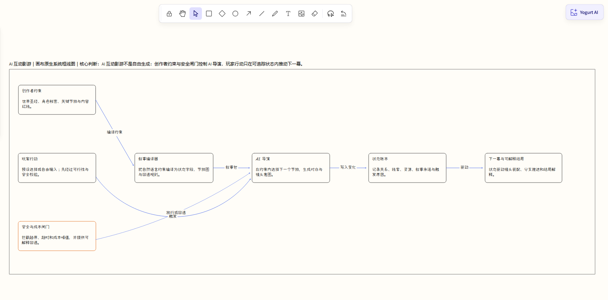

# AI 互动影游｜Yogurt 画布原生框线图案例

这个案例验证的是一项独立的 Yogurt AI 画布能力：把零散材料中的对象、关系、状态和阅读顺序，直接生成在当前画布上。它不会启动 Product Bridge，不会创建 PRD 评审页，也不会写入 `interaction-prd.json`。



## 实际输出

| 项目 | 结果 |
| --- | --- |
| 生成位置 | 当前 Yogurt 页面中的独立语义分区 |
| 原生对象 | 1 个分区、7 张可编辑卡片、6 条绑定关系线 |
| 阅读顺序 | 从左到右；循环依赖使用 SCC 分层，也支持真正的 center-out |
| 关系语法 | 主路径为蓝色实线箭头，回退/闸门为蓝色虚线箭头 |
| 可编辑性 | 分区、卡片、文案、位置和关系均可单独选择与修改 |
| 布局与连线 | 标签感知安全间距、真实边界 binding、平行 lane 与障碍物外侧绕行 |
| 追踪字段 | `diagramId`、`semanticId`、`origin`、`state`、来源 IDs |
| 与 Product Bridge 的关系 | 两个入口并行；本图不进入 PRD manifest 或 Bridge trace map |

核心 teaching claim 是：

> AI 互动影游不是自由生成：创作者约束与安全闸门控制 AI 导演，玩家行动只在可追踪状态内推动下一幕。

画布中的 7 个节点为创作者约束、叙事编译器、玩家行动、安全与成本闸门、AI 导演、状态账本、下一幕与可解释结局；加上承载核心判断的语义分区，共 8 个原生对象。完整可机器读取的实际对象、关系、binding、画布 shape ID 和应用记录见 [`native-semantic-spec.json`](native-semantic-spec.json)。

## 如何复现

在 Yogurt AI 中选中相关材料，打开右上角 `Yogurt AI` 菜单并选择 `生成画布框线图`，然后发送 [`native-canvas.prompt.md`](native-canvas.prompt.md) 中的指令。Agent 会按以下顺序工作：

1. 冻结当前选区；没有选区时使用当前页面。
2. 提炼唯一 teaching claim、对象、关系、状态和阅读顺序。
3. 先用 `dryRun` 预演同一批原生 canvas operations。
4. 基于同一 revision 原子应用语义分区、卡片与绑定关系。
5. 返回 operation ID；后续移动、改字和重新连接仍是普通 Yogurt 编辑，真实 start/end binding 是关系端点的权威数据。

本次原生图由一个独立的 semantic batch 重建并落入当前画布：

- base revision：`f5b7bb6c35023e84fa91`
- operation ID：`20260825044517450-e10ac6a5`
- 当前截图与规格对应 revision：`81462df35d4029a54140`

它与此前 Product Bridge-only 的边界收口操作 `20260825043143046-31627d4c` 是两个不同批次；后者只修改产品评审分区，不包含 `semanticDiagram`。

## 精确 SVG 是可选路线

[`precision-svg/`](precision-svg/) 保留了同一主题的安全 HTML + inline SVG 版本，用于展示精确多端口、细粒度泳道或密集避障场景。它是画布上的可选精确图块，不是默认产物，更不是 PRD 页面。

校验精确 SVG：

```powershell
node skills/cowart-semantic-diagram/scripts/validate-semantic-svg.mjs --root examples/semantic-diagram/ai-interactive-film-system/precision-svg examples/semantic-diagram/ai-interactive-film-system/precision-svg/ai-interactive-film-system.html
```

与本案例使用同一产品输入、但独立运行的 PRD 与交互原型案例见 [Product Bridge｜分岔回声](../../product-bridge/ai-interactive-film-case/)。
