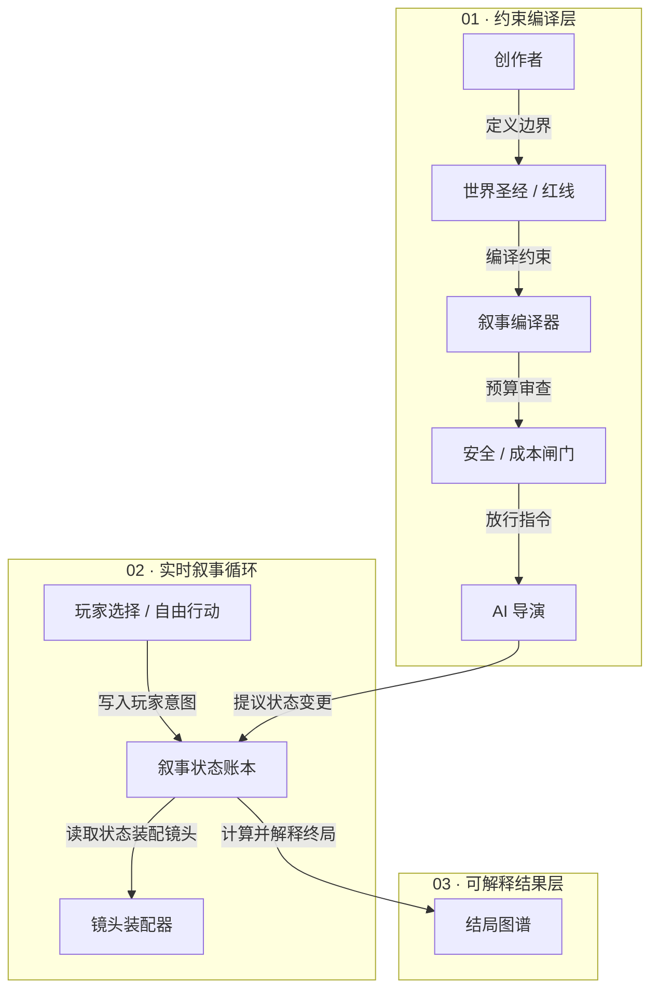

# 线框图生成提示词

请根据以下规格生成一张可访问、响应式、可编辑的 HTML 语义框线 SVG。

## 任务与教学结论

为“AI 互动影游”产品 Case 生成一张系统语义框线图。读者必须理解唯一核心判断：**创作者约束先于 AI 生成；玩家输入与 AI 导演共同更新叙事状态；状态决定后续镜头与可解释结局。**

事实边界：当前来源只有用户提出“做一个 AI 互动影游”的简述，来源 ID 固定为 `src-user-case-brief`。下述系统对象、职责、状态和关系都是为便于产品讨论而提出的 `assumption`，必须显式标记“待验证”，不得伪装成用户事实或 TAPD 事实。

## 对象与可见文字

按以下稳定 ID 创建 9 个对象；对象的 `sourceShapeIds` 均为 `src-user-case-brief`，`origin` 均为 `inference`，并携带 `assumption: true`：

1. `creator`，角色 `agent`，主标签“创作者”，说明“设定主题与禁区”。
2. `world-bible`，角色 `document`，主标签“世界圣经 / 红线”，说明“角色 · 规则 · 事实 · 禁区”。
3. `narrative-compiler`，角色 `system`，主标签“叙事编译器”，说明“把意图编译为可执行约束”。
4. `safety-cost-gate`，角色 `system`，主标签“安全 / 成本闸门”，说明“合规 · 预算 · 时延”；它是 warning 状态，但不是失败状态。
5. `ai-director`，角色 `agent`，主标签“AI 导演”，说明“在约束内提议下一步”。
6. `player-input`，角色 `interface`，主标签“玩家选择 / 自由行动”，说明“选择项、自然语言、动作意图”。
7. `narrative-state-ledger`，角色 `state`，主标签“叙事状态账本”；内部列出“事实：已发生事件”“关系：角色信任与冲突”“债务：伏笔、承诺、未决目标”。
8. `shot-assembler`，角色 `system`，主标签“镜头装配器”，说明“台词 · 画面 · 音效 · 交互点”。
9. `ending-graph`，角色 `document`，主标签“结局图谱”，说明“终点条件 + 触发因果 + 玩家回顾”。

显示三个分层标题：“01 · 约束编译层”“02 · 实时叙事循环”“03 · 可解释结果层”。在图上保留 `source: src-user-case-brief` 和“ASSUMPTION · 待验证”提示，但不要重复卡片标题或主结论。

## 关系、方向与状态

全部关系均为 `origin: inference`、`sourceShapeIds: [src-user-case-brief]`、`assumption: true`。除特殊说明外，使用蓝色实线单向箭头：

1. `creator-to-world-bible`：创作者 → 世界圣经 / 红线，类型 `flow`，动词“定义边界”。
2. `world-bible-to-compiler`：世界圣经 / 红线 → 叙事编译器，类型 `flow`，动词“编译约束”。
3. `compiler-to-gate`：叙事编译器 → 安全 / 成本闸门，类型 `flow`，动词“预算审查”。
4. `gate-to-director`：安全 / 成本闸门 → AI 导演，类型 `dispatch`，动词“放行指令”。这条顺序表达“先审查约束，后生成”。
5. `director-to-state`：AI 导演 → 叙事状态账本，类型 `transition`，动词“提议状态变更”。
6. `player-to-state`：玩家选择 / 自由行动 → 叙事状态账本，类型 `transition`，动词“写入玩家意图”。这条边必须与 AI 导演的边分开布线，不得共用一段无主干线。
7. `state-to-shot`：叙事状态账本 → 镜头装配器，类型 `dependency`，动词“读取状态装配镜头”。
8. `state-to-ending`：叙事状态账本 → 结局图谱，类型 `dependency`，动词“计算并解释终局”。

安全 / 成本闸门使用橙色实线边框与文字状态说明表达 warning；不要用红色，也不要把它画成阻断。其他对象全部为已提出、待验证的假设性系统对象，使用黑色实线框；不要用虚线让 assumption 与“未完成状态”产生歧义。

可执行 Mermaid 关系结构规格如下；只保留节点、方向和关系动词，不机械复刻 Mermaid 自动布局：

## 布局与阅读顺序

- 使用 `viewBox="0 0 1440 820"` 或等比例的宽画布。整体阅读顺序是上到下，每层内部从左到右；在 SVG 根节点声明 `data-reading-order="top-to-bottom"`，在对象与边上使用稳定的细分阅读序号。
- 第一层水平排列 5 个同高对象：创作者、世界圣经 / 红线、叙事编译器、安全 / 成本闸门、AI 导演。所有主体视觉中心 Y 对齐，偏差不超过 viewBox 高度的 0.5%。
- 第二层把玩家输入放左侧、叙事状态账本放中心、镜头装配器放右侧。AI 导演到状态账本的折线路由先向下进入独立上方通道，再从状态账本顶部边界落入；不得穿过其他节点或标签。
- 第三层把结局图谱放在叙事状态账本正下方，使用一条独立垂直关系从账本底边到结局图谱顶边。
- 每条有向关系必须从源对象的真实边界端口出发，箭头可见尖端准确落在目标边界。不同边不共享长距离线段，不制造隐式分叉或汇合。
- 关系标签占用独立空白通道，不压住节点、关系线或其他标签。对象、文字和 marker 与无关区域至少保持 viewBox 宽度 2% 的安全距离。
- HTML 容器宽度 100%、`min-width: 0`、隐藏纵向溢出；SVG 宽度 100%、高度自适应。窄屏允许外层横向滚动并保持原有阅读顺序，不重新连接或折断箭头。

## 视觉语法

- 纯白 `#FFFFFF` 画布和对象内部；黑色 `#0A0A0A` 对象框与主文字；深灰 `#171717` 正文；中灰 `#737373` 说明与关系标签；浅灰 `#E5E5E5` 辅助分隔。
- 蓝色 `#0348ED` 只用于有方向的关系线和箭头；橙色 `#FE7E0F` 只用于安全 / 成本闸门 warning 与 assumption 提示。
- 对象框线宽约 1.6，主关系线宽约 2.2，轻微圆角 `rx=6`。线宽缩放时保持不变。
- 使用系统无衬线字体；来源 ID 可用等宽字体。正文不小于 12 个 SVG 用户单位，主标签约 20 个单位。
- 禁止阴影、渐变、滤镜、纹理、噪点、背景装饰、3D、装饰图标、大面积色块，以及无语义的连线。

## SVG 技术约束

- 输出完整、静态、自包含的 HTML 文档，文档内必须且只能有一个内联 SVG；不得加载远程资源。
- SVG 根元素必须包含 `viewBox`、`role="img"`、同时引用唯一 `<title>` 与 `<desc>` 的 `aria-labelledby`、`data-cowart-diagram-id="ai-interactive-film-system"`、`data-cowart-layout="flow"` 和 `data-reading-order="top-to-bottom"`。
- 每个对象用语义 `<g>` 分组，包含唯一 `id`、`data-node-id`、`data-cowart-object-id`、`data-cowart-role`、`data-cowart-origin`、`data-cowart-source-ids="src-user-case-brief"` 和 `data-cowart-assumption="true"`。
- 每条关系用语义 `<g>` 分组，包含唯一 `id`、`data-edge-id`、`data-cowart-relation-id`、`data-from`、`data-to`、`data-relation`、`data-direction`、`data-path`、`data-cowart-origin`、`data-cowart-source-ids` 和 `data-cowart-assumption="true"`。
- 文本必须保留为 `<text>` / `<tspan>`，不得转为路径。所有可见描边图元添加 `data-cowart-stroke` 并使用 `vector-effect: non-scaling-stroke`。
- 箭头 marker ID、title ID、desc ID、节点 ID 和边 ID 全部以 `ai-interactive-film-system-` 为前缀并在整份文档中唯一。marker 的 `refX` 必须使可见箭头尖端落在目标边界。
- HTML 末尾添加且只添加一个 `data-cowart-diagram-spec` JSON template 和一个 `data-cowart-diagram-prompt` JSON template；二者都是 SVG 的 inert sibling，类型为 `application/json`，内容不得含原始小于号。规格必须完整列出对象、关系、状态、可见标签、布局与 trace。
- trace 只记录可验证的来源字段：保留已知 `pageId`、`sourceRevision`、`scope` 与 `sourceShapeIds`；不可用的 `canvasId` 必须省略，不得生成占位值或虚构标识。
- 禁止 `script`、事件属性、`foreignObject`、`image`、`filter`、`mask`、外链、远程字体、网络 URL、iframe、嵌入对象、活动表单控件和固定 SVG 根宽高。

## 验收与输出

1. 语义检查：逐条确认 9 个对象、8 条关系、关系动词和方向与上述规格一致，没有把并列或包含误画成箭头；所有扩展内容都标记 `assumption`。
2. 结构检查：从 Cowart 仓库根目录运行 `node skills/cowart-semantic-diagram/scripts/validate-semantic-svg.mjs --root examples/semantic-diagram/ai-interactive-film-system/precision-svg examples/semantic-diagram/ai-interactive-film-system/precision-svg/ai-interactive-film-system.html`，要求 0 错误、0 警告。
3. 边界检查：确认该 HTML 只作为 Yogurt 画布上的可选精确图块，不写入任何 Product Bridge `interaction-prd.json`、页面或 trace map。
4. 几何检查：在真实桌面宽度和窄屏横向滚动容器中核对同级中心对齐、2% 安全距离、viewBox 裁切、文字碰撞和 marker 落点。
5. 连线检查：从每个源边界连续追踪到目标边界；不得穿过节点或文字，不得共线粘连，不得出现脱节箭头。
6. 视觉检查：确认第一眼先看到约束链，其次看到“双输入更新账本”，最后看到“账本分发到镜头与结局”；蓝、橙两种强调色只承担规定语义。
7. 可访问性检查：`title` 与 `desc` 能独立复述对象、方向、警示状态与 assumption 边界；不看图也能从邻近正文理解核心结论。
8. 提示词一致性检查：嵌入提示词、JSON 规格、本文件与最终 SVG 必须同步，不保留已经放弃的对象、关系、标签或布局。

最终输出完整可编辑 HTML 与内联 SVG，而不是位图、截图或只有解释文字的答案。
